## 关于博主

richfan，毕业于深圳大学金融学，本科，学士学位

## 证书

```mermaid
gantt
  title 考证进度（%）
  dateFormat X
  axisFormat %s
  section 中级会计师
  100   : 0, 100

  section 中级审计师
  100   : 0, 100

  section 税务师
  100   : 0, 100

  section 初级会计师
  100   : 0, 100

  section 证券从业资格证
  100   : 0, 100

  section 基金从业资格证
  100   : 0, 100

  section 银行从业资格证
  100   : 0, 100

  section 期货从业资格证
  100   : 0, 100

  section 保荐代表人
  30   : 0, 30

  section 律师
  20   : 0, 20

  section 注册会计师
  16   : 0, 16

  section 董事会秘书证
  0   : 0, 0

  section 一级评估师
  0   : 0, 0
```



## 擅长

- 财务
- 审计
- 税务
- 法律
- 投行
- 设计
  - 平面设计
  - 视频剪辑
  - 3D建模
- 编程
  - html
  - css
  - javascript
  - php
  - python
  - go
  - vba
- 烹饪

## 前置参数

* **title**: 文章标题
* **subtitle**:  文章副标题
* **date**: 这篇文章创建的日期时间它通常是从文章的前置参数中的 `date` 字段获取的，但是也可以在 [主题配置][theme-config] 中设置
* **lastmod**: 上次修改内容的日期时间
* **draft**: 如果设为 `true`, 除非 `hugo` 命令使用了 `--buildDrafts`/`-D` 参数，这篇文章不会被渲染
* **author**:  文章作者配置，和 [主题配置][theme-config] 中的 `params.author` 部分相同

    ```yaml
    author:
      name: "" # 文章作者
      link: "" # 文章作者的链接
      email: "" # 文章作者的邮箱，用于设置 Gravatar 头像，优先于 `author.avatar`
      avatar: "" # 文章作者的头像
    ```

* **authorLink**:  ~~文章作者的链接~~，合并到 `author.link`
* **authorEmail**:  ~~文章作者的邮箱~~，合并到 `author.email`
* **gravatarForce**:  ~~强制使用 Gravatar 作为作者头像~~
* **authorAvatar**:  是否启用文章作者头像
* **description**: 文章内容的描述
* **keywords**: 文章内容的关键词
* **license**: 这篇文章特殊的许可
* **images**: 页面图片，用于 Open Graph 和 Twitter Cards

* **tags**: 文章的标签
* **categories**: 文章所属的类别
* **featuredImage**: 文章的特色图片
* **featuredImagePreview**: 用在主页预览的文章特色图片

* **hiddenFromHomePage**: 如果设为 `true`, 这篇文章将不会显示在主页上
* **hiddenFromSearch**:  如果设为 `true`, 这篇文章将不会显示在搜索结果中
* **twemoji**:  如果设为 `true`, 这篇文章会使用 twemoji
* **lightgallery**:  和 [主题配置][theme-config] 中的 `params.page.lightgallery` 部分相同
* **ruby**:  如果设为 `true`, 这篇文章会使用 [上标注释扩展语法][ruby-syntax]
* **fraction**:  如果设为 `true`, 这篇文章会使用 [分数扩展语法][fraction-syntax]
* **fontawesome**:  如果设为 `true`, 这篇文章会使用 [Font Awesome 扩展语法][fontawesome-syntax]
* **linkToMarkdown**: 如果设为 `true`, 内容的页脚将显示指向原始 Markdown 文件的链接
* **rssFullText**:  如果设为 `true`, 在 RSS 中将会显示全文内容
* **pageStyle**:  页面样式，详见 [页面宽度][page-style]

* **toc**:  和 [主题配置][theme-config] 中的 `params.page.toc` 部分相同
* **expirationReminder**:  和 [主题配置][theme-config] 中的 `params.page.expirationReminder` 部分相同
* **code**:  和 [主题配置][theme-config] 中的 `params.page.code` 部分相同
* **edit**:  和 [主题配置][theme-config] 中的 `params.page.edit` 部分相同
* **math**:  和 [主题配置][theme-config] 中的 `params.page.math` 部分相同
* **mapbox**:  和 [主题配置][theme-config] 中的 `params.page.mapbox` 部分相同
* **share**: 和 [主题配置][theme-config] 中的 `params.page.share` 部分相同
* **comment**:  和 [主题配置][theme-config] 中的 `params.page.comment` 部分相同
* **library**:  和 [主题配置][theme-config] 中的 `params.page.library` 部分相同
* **seo**:  和 [主题配置][theme-config] 中的 `params.page.seo` 部分相同
* **type**: 页面渲染模板，详见 [页面模板](#templates)
* **menu**: 详见 [添加内容到菜单][content-to-menu]

* **password**:  加密页面内容的密码，详见 [内容加密](#content-encryption)
* **message**:  加密提示信息，详见 [内容加密](#content-encryption)

* **repost**:  和 [主题配置][theme-config] 中的 `params.page.repost` 部分相同
* **autoBookmark**:  和 [主题配置][theme-config] 中的 `params.page.autoBookmark` 部分相同
* **wordCount**:  和 [主题配置][theme-config] 中的 `params.page.wordCount` 部分相同
* **readingTime**:  和 [主题配置][theme-config] 中的 `params.page.readingTime` 部分相同
* **endFlag**:  和 [主题配置][theme-config] 中的 `params.page.endFlag` 部分相同
* **reward**:  和 [主题配置][theme-config] 中的 `params.page.reward` 部分相同
* **instantPage**:  和 [主题配置][theme-config] 中的 `params.page.instantPage` 部分相同