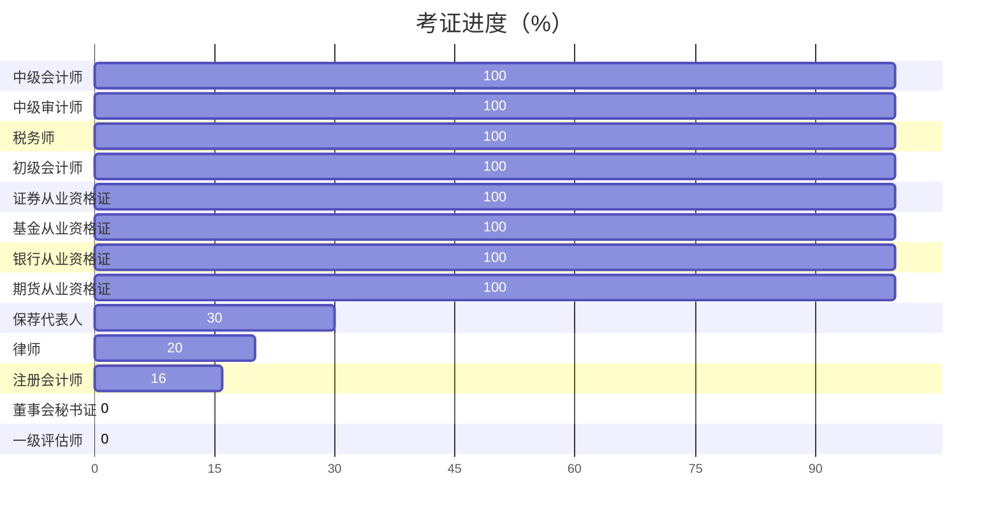

## 关于博主

richfan，毕业于深圳大学金融学，本科，学士学位

## 证书

```mermaid
gantt
  title 考证进度（%）
  dateFormat X
  axisFormat %s
  section 中级会计师
  100   : 0, 100

  section 中级审计师
  100   : 0, 100

  section 税务师
  100   : 0, 100

  section 初级会计师
  100   : 0, 100

  section 证券从业资格证
  100   : 0, 100

  section 基金从业资格证
  100   : 0, 100

  section 银行从业资格证
  100   : 0, 100

  section 期货从业资格证
  100   : 0, 100

  section 保荐代表人
  30   : 0, 30

  section 律师
  20   : 0, 20

  section 注册会计师
  16   : 0, 16

  section 董事会秘书证
  0   : 0, 0

  section 一级评估师
  0   : 0, 0
```

## 擅长

- 财务
- 审计
- 税务
- 法律
- 投行
- 设计
  - 平面设计
  - 视频剪辑
  - 3D建模
- 编程
  - html
  - css
  - javascript
  - php
  - python
  - go
  - vba
- 烹饪