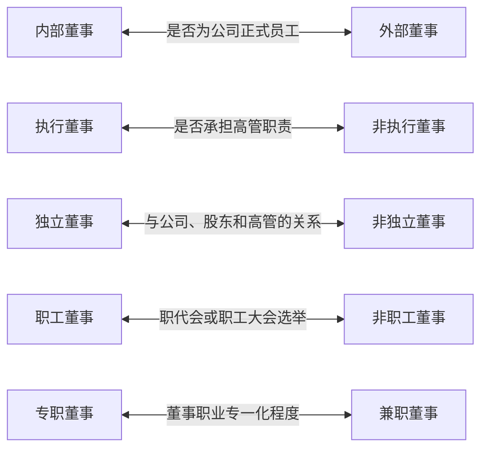

导语：“正所谓伟大的董事会创造伟大的公司。”董事会作为公司内部治理结构的核心，是公司治理制度完善的关键。无论采用什么样的公司治理模式，董事会的质量都是决定公司治理水准高低的核心要素。企业能否具有活力、能够在竞争中脱颖而出，关键在于董事会。正确处理好董事会与各层之间的关系，不断完善符合公司自身经营特点的董事会运行机制，是一个企业得以长久屹立之根本所在。

## 1、董事会的基本解读？

**答：** 在现代法人治理结构体系中，董事会是链接股东和管理层的“桥梁”，是其他治理机制发挥作用的重要“平台”，也是基础的公司治理机制的内部控制系统。所以，董事会的质量是决定一个公司未来业绩好坏和股权回报的重要指标。董事会作为一个企业的经营决策机构，主要由董事们组成。

除了董事，董事会还有一些附属机构或者岗位，比如董事会秘书、董事会专业委员会，这些机构与岗位都由董事会组建或者任命，辅助董事会开展具体决策与经营活动，对董事会负责。

## 2、董事会在公司治理中的地位以及功能？

**答：** 在整个公司治理内部机制中，董事会治理居于核心地位。作为股东利益代表的董事会具有双重功能：一方面作为经营者要负责公司的重大经营决策；制定政策和制度；对全体股东负责和向股东报告公司的经营状况，以确保公司的管理行为符合国家法规；雇佣管理人员经营公司而使股东的资产增值；另一方面要履行监督职责，监督经理人员的行为，防止其损害股东利益。

董事会的功能定位是由股东（股东会）赋予的，而董事会会根据企业的经营特点以及董事会的情况，将股东会授权给自己的部分权力再次授权给经理层，从而形成多层级委托代理行为。从这方面来看，经理层是向董事会负责，而不是向股东会负责的。

《公司法》对董事会角色定位：

1）董事会是公司的决策机构，由股东会选举产生，按照股东会的要求、授权开展工作的机构。

2）对股东会负责董事会是公司治理的核心，并发挥着至关重要的作用。在实际运营中，董事会必须从经济，战略和效率三个方面着眼，以确保企业的持续健康发展。

36号文对董事会角色定位：

《关于进一步完善国有企业法人治理结构的指导意见》（国办发〔2017〕36号）指出：

1）董事会是公司的决策机构。

2）董事会要对股东会负责，执行股东会决定，依照法定程序和公司章程授权决定公司重大事项，接受股东会、监事会监督，认真履行决策把关、内部管理、防范风险、深化改革等职责。

国有独资公司要依法落实和维护董事会行使重大决策、选人用人、薪酬分配等权力，增强董事会的独立性和权威性，落实董事会年度工作报告制度；董事会应与党组织充分沟通，有序开展国有独资公司董事会选聘经理层试点，加强对经理层的管理和监督。

新型国有企业三个治理主体的功能定位

| 国有企业各治理主体功能定位 |        |     |                 |                                 |
|---------------|--------|-----|-----------------|---------------------------------|
| 治理主体          | 作用     | 职能  |                 |                                 |
| 党委            | 领导作用   | 把方向 | 领导侧重“4个是否”      | 是否符合党的理论和路线方针政策                 |
|               |        | 管大局 |                 | 是否契合党和国家的战略部署                   |
|               |        |     |                 | 是否有利于提高企业效益、增强企业竞争实力、实现国有资产保值增值 |
|               |        | 保落实 |                 | 是否维护社会公众利益和职工群众合法权益             |
| 董事会           | 决策作用   | 定战略 | 决策侧重“4个分析”      | 分析决策事项与公司发展战略的一致性               |
|               |        | 做决策 |                 | 分析决策事项合法合规性                     |
|               |        |     |                 | 分析可行性、必要性、经济性、社会性               |
|               |        | 防风险 |                 | 分析并化解各类风险                       |
| 经理层           | 经营管理作用 | 谋经营 | "经营管理侧重“4个重点""" | 重点拟定战略执行计划、经营计划及财务预算            |
|               |        | 抓落实 |                 | 重点执行党委会、董事会决策决议                 |
|               |        |     |                 | 重点拟订并执行基本管理制度及制定公司化规章           |
|               |        | 强管理 |                 | 重点抓好运营管理                        |

## 3、董事会在公司治理中的作用？

**答：** （1）董事会作为公司的代表与各方建立良好关系。各方包含了所有的股东方、政府机构、社会公众、企业外部合作单位、债权人以及内部的各级员工等。

（2）董事会的决策在着眼于公司长远利益的同时，还要兼顾公司的大小股东、公司债权人以及公司职工等各方利益，公司董事会的运作要符合公司治理相关法律法规以及公司章程的要求。

（3）董事会拥有法定的支配公司财务权利，同时也依法对公司承担相应的义务和责任。董事会应该做到该董事会管的要管，不该董事会管的坚决不管，既发挥董事会的决策作用，又发挥经理层等其他机构的积极性。“既要到位”，“又不越位”。

## 4、董事会在公司治理中显示的治理能力是什么？

**答：** 董事会作为公司治理的核心，具有决策和监督的作用，所以董事会治理的关键就是要通过一系列的内部、外部机制来实施共同治理，保证决策的科学性、监督的有效性，从而保证公司各方面利益相关者的利益最大化。
决策的科学性是董事会的最重要的治理能力，通过董事们的专业能力，利用一系列的辅助机构的支持，董事会做出符合公司长远利益与各个股东利益的决策，以维护企业的长期发展。

监督作用包含两个方面，一方面是董事会要建立有效的机制，监督董事会决策在经营层的落实，以确保决策实现得到保证。另一方面是董事会要监督经理层的行为不损害公司利益、股东利益。

## 5、目前，存在哪几种不同风格的董事会？

**答：** 国内对董事会并没有明确的分类，根据全美董事联合会咨询委员会（NACD）提出的功能性分类，可分为把董事会分为四类：

（1）橡皮图章型董事会（rubber-stamp board）。即双低型。这种风格的董事会，对人际关系的关切程度和对工作的关切程度都很低，它不能起到董事会的真正作用，往往是为了对付公司法而组建的。一般来说，设在海外避税港的“皮包公司”多属于此类。还有一些私人封闭型公司，会把董事会当作一种摆设。这种董事会往往是个人在董事会里说了算，或者因为重要人物可以经常见面，决策通常在管理层一级做出，所以，即便是董事会决议，也不过是履行法定程序而已。

（2）乡村俱乐部型董事会（Country-club board）。它对人际关系的关切程度高，对工作的关切程度低，这种董事会与其说是进行经营决策的，不如说是进行感情沟通的。它的特点是，一般在召开董事会时往往有很多仪式。关于公司的传奇经历和神话常常出现在董事会会议上。董事会会议总是遵循一个固定的模式，在历数完公司的传统之后，就是歌功颂德，创新受到压抑，这些董事会往往存在于一些成立较早、成绩斐然的公司中。在这种董事会治理下，公司治理实际上有高管层在操作。

（3）代表型董事会(representative board)。这种风格的董事会对工作的关切程度要大于人际关系的关切程度。在这样的董事会里，不同的董事明显代表着不同利益的股东，或者不同的利益相关者，尤其是投资机构和银行等等。这种董事会的讨论议题很容易被政治化，就像立法机关那样争争吵吵，讨论过程常常针锋相对。这样的董事会“权力的基础和平衡”显得至关重要。但这种董事会对企业决策有着重要影响。

（4）专业型董事会（professional board）。这种董事会能够很好履行职能，实现董事会的使命。它既高度关注工作任务，也高度关注人际关系。这种风格的形成，与董事长的作用关系密切，专业型董事会的董事长有很强的领导能力。董事会成员之间的讨论非常务实、相互理解、相互尊重。

案例：某国有企业集团对不同公司类型，设置不同功能的董事会

| 公司名称              | 董事长             | 董事长性质   | 董事会构成                 | 董事会性质       |
|-------------------|-----------------|---------|-----------------------|-------------|
| 新XX               | 核心领导            | 决策型     | 原两钢领导层、国资委委派董事        | 决策董事会       |
| XX集团公司            | 核心领导            | 监督型     | 原XX领导层，压缩董事职数         | 形式董事会       |
| 北钢集团公司            | 核心领导            | 监督型     | 原北钢领导层，压缩董事职数         | 形式董事会       |
| XX板材、北营钢铁         | 核心领导            | 决策型     | 新XX领导层为主充任            | 决策董事会       |
| 功能性平台全资子公司        | 分管领导或其他人员       | 仪式型     | 不设董事会，采取执行董事制         | 底限董事会       |
| 参股企业、部分类承包的子公司    | \               | \       | 根据企业规模、合作方层级等方面选派我方董事 | 监督董事会       |
| 纳入资产管理公司旗下的待处置子公司 | 资本运作、资产管理职能分管领导 | 监督型     | 资本运作、资产管理审计、财务职能部门充任  | 形式董事会       |
| 其他子公司             | 集团分管领导或其他人员     | 决策型/监督型 | 新XX人员占据多数席位           | 决策董事会/监督董事会 |

## 6、我国董事会的现状如何？

**答：** 从董事会结构和运作来看，我国非上市公司的内部董事占绝大多数，董事会结构不合理导致权力失衡，董事会通过聘任符合自己利益的公司经理层，达到层层控制公司目的。

目前，在我国多数的国有企业的董事、经理还是由控股股东委派而来，其代表股东行使的权力过大，甚至出现了不少董事长兼任总经理的情况，总经理取代了董事会的部分职权，将董事会架空，自己管理自己、自己评价自己、成为名副其实的“内部控制人”董事会的功能、特别是其监督功能不健全。

除董事会成员绝大多数是本公司的经理人员，同时普遍缺乏一些辅助机构（专业委员会）等，还有一些企业，董事会下虽然设立了各专业委员会，但是作用有限，很大程度上是一个专家议事机构，几乎全由内部人组成，对公司的高层经理很难起到有效监督作用。

## 7、我国上市公司董事会在公司治理中存在的问题有哪些？

**答：** **（1）缺乏形成权力制衡的产权基础，股权高度集中。**我国上市公司缺乏形成权力制衡的产权基础，主要表现是股权结构的不合理。我国绝大部分上市公司由国企改制而成，股权高度集中，使得第一大股东利用控股地位几乎完全支配了公司董事会，从而导致公司治理结构的不平衡。

**（2）缺乏良好的问责机制。**单个董事在观念和行为上往往更多的是代表和追求本身作为单个个人或代表特定的股东的利益，而不是代表整个公司的利益和追求公司价值最大化。股东大会、董事会、监事会的职责分工不明确，往往成为橡皮图章，形同虚设。在公司信息披露过程中，常常出现明显的利润操纵和股权市场的内幕交易现象。

**（3）董事会会议形式化**。首先是董事会会议的次数过少，很多企业一年才开一次董事会。其次董事会会议的内容不合理，我国公司董事会关注和工作的重心在经营规划和财务安排上，对于企业发展的长远战略规划关注度不够。另外，董事会会议的董事缺席率总是居高不下。

## 8、我国中央企业董事会的建设经历了哪些历程？

**答：** 中央企业董事会建设，经历了从“试点”到“全面建设”的过程。

第一阶段，2004年开始，经国务院批准，国资委开展规范董事会建设试点，确定神华集团、宝钢集团、诚通控股、中国医药等7家国有企业为第一批试点企业。国资委将外部董事占多数作为核心制度，将一把手负责制变革为分权制衡，实现决策组织与执行组织的分离，充分发挥董事会在重大战略决策、风险管控、经理层管理等方面的作用。

第二阶段开始于2010年，国资委决定中央企业董事会规范制度建设从“试点”转为“全面建设”，试点企业户数不断扩大，进行了包括国投在内的10家中央企业的董事会规范化建设。

第三阶段是十八届三中全会前后，中央企业董事会规范化建设开始急速扩容，与第二阶段相比，不仅在数量上翻倍，而且在进度上也明显加快。

到2017年，中央企业集团层面公司制改制方案全部批复完毕，绝大多数中央企业建立了董事会，其中外部董事占多数。同时，国资委还在部分中央企业开展落实董事会职权试点，把中长期发展决策权、经理层成员业绩考核权、经理层成员薪酬管理权、职工工资分配管理权、重大财务事项管理权等核心职权授予了试点企业董事会。

## 9、目前，中央企业董事会建设成效如何？

**答：** （1）“一言堂”问题有效解决。过去国有企业中存在一把手“一言堂”的问题，为企业经营带来了较大风险，同时存在滋生腐败的土壤。

（2）运筹决策更加民主科学。企业内部的董事会成员，不论是党委委员还是副总经理，与党委书记、总经理是领导与被领导关系，因此，很难提出尖锐的意见和建议。而国企董事会建立起外部独立董事的机制，并且对外包部董事的比例提出了明确的要求。外部董事对重大决策能够独立发表意见，相对比较超脱、客观，能够有效保障企业的决策合理性。实践中，外部董事有重大异议的，“内部人”基本不会强推，制衡机制起了作用。

（3）企业管理更加高效规范。建设积极董事会，董事会的严格要求，使经理层和职能部门责任感增强，落实董事会决议更加迅速、严格。同时，通过科学界定董事会与经理层之间的权责，推进职业经理人制度建设，有效激发经理层活力，进而推动企业快速发展。

（4）风险管控更加稳妥有效。外部董事更多地关注风险，企业防范风险的意识和内部管控能力大大增强。很多董事会试点企业都有议案被董事会否决、缓议或多次审议才予以通过的情况。例如，神华集团董事会曾经在讨论收购东南亚某国一家电厂项目时，外部董事认为项目面临社会风险，否决了收购议案，从而避免了潜在的损失。

## 10、在中央企业中，董事会建设的经验有哪些？

**答：** （1）党的领导与董事会建设相统一。在中央企业中，党委（党组）发挥着领导作用。通过明确党委（党组）研究讨论是董事会、经理层的前置程序，把关方向，剔除不符合国家大局、国企改革方向、企业发展方向等事项或备选方案，保证“三重一大”决策事项责任明确、程序清晰，有效规避潜在风险。同时，厘清企业党委（党组）“把方向、管大局、保落实”与董事会“战略管理、科学决策、防控风险”的职责权限，最终重大经营管理事项仍由董事会或经理层决策。

（2）规范董事会承担的职能。一是确保国有资产保值增值的职能。二是保障国家经济社会安全的职能。对于重大事项的战略管控职能。

（3）聚焦外部董事制度建设。通过一段时间的试点证明，外部董事的设置，有助于提升中央企业的国际化和规范化水平；有声望的外部董事能够为公司带来良好声誉，提高企业的吸引力和竞争力；外部董事特别是独立董事可以显著增加董事会独立性，使公司决策不受个别股东的干扰；外部董事进入董事会能够增加关键信息透明度，有效避免了内部控制现象；通过事前控制和多方协调，能够有效提高企业的风险防控能力。

## 11、在具体实践中，企业如何清晰界定和选择董事会的作用？

**答：** 董事会是公司业务执行机构和经营决策机构，一般的公司惯常地以章程定义董事会职责，而章程几乎千篇一律的是对《公司法》条款的援引。但事实上，在法律的框架内，股东通过授权定义着董事会的角色，而董事会也在股东授权范围内通过对管理层的授权决定着自身的角色，每个董事会因此而发挥着不同的作用。清晰界定董事会的角色，即确定一个双方认可的董事会和管理层的职责分界，这是完善其治理、建立高效董事会的起点，每个董事会应当根据其选择的作用，设计自己的组织结构、选择成员、改革工作程序以及行为方式等。

董事会从事监督公司和管理层的业绩；审议、制定公司主要决策；向管理层提供建议和咨询等三类业务，这三种类型活动的特定组合界定了董事会的作用。企业应根据董事会介入公司管理事务的程度高低不同，可以选择“领航员偏好的董事会”和“监管者偏好的董事会”。

## 12、影响董事会选择自身角色的因素有哪些？

**答：** 一是公司环境。假如企业陷于困境或者出现可能导致业绩下滑的风险，公司业务的复杂程度高，公司所在行业正处于快速变化阶段，则要求有更加投入的董事会。

二是股东的要求。股东的期望决定着董事会对公司管理事务的参与程度。如果股东与公司经营距离较远，或者不太可能有经历、有能力参与公司决策与监督，则股东层可能会倾向于更多的依赖于董事会来代行自己的职责。

三是董事会与经理层的关系。当经理层已经建立了成功领导公司业绩的履职记录，并且董事会增加了对经理层能力的信任时，董事会可能希望较少介入公司管理活动，将更多的管理权限移交给经理层。

四是董事会所具有的与其希望发挥作用相匹配的资源和能力，包括外部董事能够并愿意投入的工作时间、董事们的经验和知识，特别是对其任职公司的了解等都是董事会发挥作用的现实约束。如果董事会大多数是由兼职外部董事构成、或者董事的知识能力有限，则董事会参与公司决策与经营，发挥董事会作用的意愿就会越小。

## 13、在新的组织变革中，企业从“监管型”董事会迈向“战略型”董事会是如何演变的？

**答：** 这个问题需要从企业形态进化规律以及董事会角色演变规律说起。

首先，在市场生态发展过程中，企业形态沿着产业价值链不断演变，经历了股东价值形态、精英价值形态、客户价值形态、利益相关者价值形态等四种典型组织形态，实现了从低级组织形态向高级组织形态的进化。其中，精英价值形态就是人们常说的“金字塔”形，也是中国传统企业形态，通常采取监管型董事会；利益相关者价值形态是工业4.0时代的产物，尚未到来，而客户价值形态则是新商业时代的最佳企业形态，也可以称之为新组织，通常采取战略型董事会。所以，传统企业转型迈向新组织的过程也是由从“监管型”董事会迈向“战略型”董事会转变的过程。

其次，在企业形态进化过程中，董事会也发生了相应变化，四种典型的组织形态有四种不同的董事会形式，分别是单一型董事会、监管型董事会、战略型董事会、价值性董事会。
传统企业转型，将从精英价值形态迈向客户价值形态，因此董事会也将从“监管型”董事会迈向“战略型”董事会。

## 14、什么是单一型董事会？

**答：** 主要是由控股股东、亲友或其代理人构成，所谓单一是指决策权与所有权、执行权之间边界并不清晰，均由股东及其代理人行使，所有权力高度集中于单一决策者，最后掌握在股东手中，属于一种单人决策模式。一般传统的民营创业公司以及之前国有企业基本都属于单一型决策模式。

单一型董事会完全体现控股股东的意志，今天看来董事会的设置更多是为了符合公司法的要求，因而是一种形式上的决策机构，虽然企业治理结构也有基本的运作流程与规章制度，但基本形同虚设，而董事会仅仅发挥“橡皮图章”的作用。如今这种董事会依然存在，但数量开始逐渐减少。

单一型董事会的问题是没有在企业中形成董事会、监事会、经理层的相互制约机制，由于缺乏对经理层的有效制约与监管，也没有让经理层专心致志于日常的经营工作，非常容易造成企业的决策失误以及道德缺失。

## 15、什么是监管型董事会？

**答：** 主要由股东代表和精英代表组成，所谓“监管”就是发挥监督、促进、约束、激励等功能。控股权股东控制股东会，精英团队掌握执行权，需要董事会协调这两个价值主体的价值冲突，这时董事会行使经营决策权，精英团队行使经营管理权，所有权、决策权、执行权之间边界非常清晰。

股东通过董事会决议传递资本价值诉求，精英代表通过董事会决议传递精英价值诉求，双方在董事会中实现价值诉求的协调。这时董事会为了平衡收益与风险之间的矛盾，对精英团队既要激励又要约束，这两方面功能既对立又统一性导致董事会必然采取团队协作决策模式，这种监管型董事会是目前传统企业主要采取的方式。

监管型董事会主要存在于股东所有权与经理层执行权相对分离的企业中，由于股东层很难兼顾到企业的具体经营决策，必须依赖于市场化的职业经理人机制来实现股东的经营目标，此时利用董事会作为股东与经理层之间的监督与沟通桥梁，放开对经理层的过多控制，是比较好的一种治理模式。

## 16、什么是战略型董事会？

**答：** 战略型董事会是以市场价值需求为导向，充分发挥董事会独立决策功能。这时企业股权结构的相对分散，股东构成多元化，员工普遍持股，董事会最初由股东代表、精英群体、合伙人、员工代表、独立第三方代表共同组成。
当董事会承载着众多利益主体的价值诉求时，促使董事会体现企业组织的价值诉求，要求董事代表企业组织而非某个利益主体，因此最后董事会将由多数独立董事构成，形成一种多元独立决策模式，即民主决策。

由于股东构成相对分散，单一股权对企业影响较弱，因此在治理结构中董事会的功能显得非常强大，战略型董事会使不同价值主体的价值诉求得到了统一。

万科多年来形成的治理结构就是典型的战略型董事会。战略型董事会由于缺少足以控制企业决策的大股东，非常容易受到外部野蛮资本的介入，万宝之争体现的就是这种治理模式的重大缺陷。

战略型董事会由于缺少股东控制，还非常容易形成内部人控制，董事会会利用自己对企业决策的控制权为自身攫取利益。这就需要社会监管机构（类似于证券交易所）对此类公司的治理实行有效的监管。可以说，外部监管环境的成熟，对战略董事会的形成至关重要。

## 17、董事会的主要职责是什么？

**答：** 董事会的主要职责包括以下四个方面：

（1）确定公司重大决策。

（2）监督和评估战略规划和年度预算。

- 审核公司重大投资计划
- 审批公司利润分配方案和红利方案
- 审批公司增加或减少注册资本方案以及发行公司债务方案
- 决定公司合并、分离和解散的方案
- 决定公司内部组织结构和高层的管理机构设置
- 
（3）监督公司管理层。

- 负责公司总裁的继任计划
- 聘任或解聘公司总裁
- 根据总裁提名，聘任或解聘公司副总裁、财务总监等公司高级管理人员
- 评估最高管理层的业绩
- 决定高层管理人员的薪酬计划
- 建立和维持程序来保证公司中的法律和道德做法

（4）与股东的沟通。
- 负责召集股东大会，并向股东大会报告工作
- 负责执行或协调股东大会的决议
- 负责与外部股东的沟通计划
（5）董事会自身建设。
- 董事人员的推荐
- 董事会会议的设定、日程和议题

## 18、企业如何建设一个专业的董事会？

**答：** 众所周知，现代公司治理的一个典型特征是所有权与经营权的分离，在这种情况下，企业需要减少代理风险，控制代理成本，其核心就是建设一个专业董事会。

想要建立专业董事会的前提就要先解决董事会的组成问题，应推动董事会成员的多元化，引入外部董事、独立董事、职工董事，改变权力过于集中、内部人控制的格局，提高决策的科学性和决策效率。

确保代理人不会背离委托人的根本利益，以达到对公司内部决策层、经营层的监督、制衡，推动公司的可持续发展。

## 19、构建董事会的组织结构应该考虑哪些问题？

**答：** 董事会结构的设计在董事会治理中颇受关注，主要是由于结构是可观察的且结构的变化是可衡量的，但并没有普适性理想的董事会结构模型，只有一些国内外共同经验参照。

首先，董事会运作结构必须保证整个董事会的独立性。董事会对于公司的事务应该能够行使客观独立的判断，根据公司和股东的最大利益履行职责。

其次，完善董事会下设的专业委员会，董事会专业委员会是指由董事会设立的由公司董事组成的，行使董事会部分权利或者为董事会行使权利提供帮助的董事会内部分支机构。

董事会是会议机关，在董事会内部设立委员会并使其发挥作用可以在一定程度上克服经理层中心主义现象。

此外，诸如评估管理层的表现和对董事及管理层执行职务的审计也需要监督主体在董事和管理层日常履行职务的过程中加以考察和评估，仅仅依靠董事会会议的讨论是不够的，通过将董事会的工作在不同委员会中进行分工，将有助于提高董事会的工作效率，有助于提高董事的素质和经验，有助于外部董事加强他们的的监督并参与公司事务，也更容易明确董事的义务和责任。

## 20、董事会的规模受到哪些规范指引？

**答：** 一般企业：均需根据《公司法》的要求设定董事会规模。《公司法》规定，设置董事会的有限责任公司，成员规模在3人至13人（第四十四条），股份有限公司的董事会规模在5人至19人（第一百零八条）。

由国务院国资委履行出资人职责的国有独资公司：董事会原则上不少于9人，不多于13人（《董事会试点中央企业董事会规范运作暂行办法》的通知）。

上市公司：除《公司法》外，无其他特殊规范约束

## 21、为什么董事会的规模要进行适当控制？

**答：** 董事会规模越大，进行盈余管理的可能性越大，公司的绩效也就越差。董事会规模偏大，同时也影响着董事会在决策中的沟通和协调，降低了董事会的决策效率。

除了独立董事外，上市公司董事会包含了一定比例的非执行董事。这些董事是大股东的代表，往往不在公司领取薪酬也不持有公司股票，他们也是董事会规模过大的重要原因。

提高独立董事比例应该从缩小董事会规模入手，而不是大力引进独立董事。

## 22、一家企业到底应该由多少个董事组成最合理、最有效、最可操作呢？

**答：** 董事会不是越大越好，董事也不是越多越好，这是一个决策机构，要保证必要的效率，所以在设计董事会人员的时候，除了考虑公司的股权结构、治理目标以及相关政策要求外，还需要本着与企业发展阶段相适应的基本思路，从小起步，科学至上。

如果是刚刚成立的公司，正处在企业发展的初期阶段，可以结合政策设置3人董事会，提高决策效率效果。

如果公司开始进入到市场化快速发展的阶段，有了多元股东，需要外部支撑，这时可以考虑增加董事名额，建立5人、7人董事会。

如果公司进入了成熟期，市场规模较大，建立了下属投资企业、开始全国业务布局，并且有更多的资本市场和社会监督要求，可以继续增加董事会成员，丰富董事来源，建立7人、9人的董事会。

若企业已经成为一家全国性、国际性、集团性公司，可以加以考虑建设10人以上的董事会。倘若还没达到这个阶段，暂时不建议董事会“虚胖”。

## 23、董事会成员如何组成？

**答：** 企业在建设专业的董事会时，应推动董事会成员的多元化，引入外部董事、独立董事、职工董事，改变权力过于集中、内部人控制的格局，以达到对公司内部决策层、经营层的监督、制衡作用。

董事会的构成是要形成积极董事会，主要参照以下几个方面：

- 董事会结构的平衡：

董事会的结构包括知识结构、年龄结构、技能结构、股权结构、职能结构等等。一个结构合理、平衡的董事会能够高效地制定出集团关键战略的决策，进而有益于集团长期和短期的绩效。董事会应该明确作为一个团队，它所需要的技能和阅历，及时补充现有人力资源，并为未来的需要进行人才培养和储备。

- 保持董事会的多样性：

董事选拔的主要目的是提名那些具有各种专业知识、技能和专长的个人，从而有助于集团的正确决策和成功经营。因此，董事会应该扩大人才库，更加广泛地囊括符合未来战略要求的候选人，使董事会获得最有价值的人才。
结合集团发展的实际需要：

在集团成长和变革的不同阶段和不同时期，要求董事们具有不同的素质和能力。董事会应不断地考虑集团的实际状况和战略需要，决定何种董事素质与能力最有利于推进董事会绩效的改进，有利于集团现在和未来的成功，有利于集团在不同阶段拥有最合适和最有效的人力资源。

## 24、国企董事会里应包括哪些人？

**答：** 董事会的决策科学性，一部分来源于其结构上的多元化、独立性。所以各个国家、大量企业实践都指向要求一个结构相对丰富多元的董事会。

根据现有规定，一般国有企业董事会要包括三类人员：

第一类，公司内部部分高级管理人员要成为董事会成员。党委书记要兼任董事长，专职党委副书记要进入董事会，总经理进入董事会，其他高级管理人员视需要担任董事。

第二类，股东派任企业外部人员。这一类人员通常称为外部董事，是股东单位选派担任企业董事的专职或者兼职人员。按照相关政策要求，在符合条件的企业，外部董事要占多数。这样的安排，是希望对于企业内部人员形成制衡，突出决策的独立性。

第三类，职工董事。职工董事是通过职工代表大会选举，代表职工民主参与企业管理的关键岗位。

除此之外，由于各家企业的发展阶段和业务特点不同，还可以根据需要配备其他董事成员。比如，准备上市的企业，需要更多外部专家力量的企业，可以增加独立董事岗位；科技含量高的企业，可以增加科学家进入董事会等等。

## 25、不同的董事会成员类型是如何划分的？

**答：** 董事会成员有很多类型，例如，董事可以是内部董事、外部董事、执行董事、非执行董事、独立董事、非独立董事、职工董事等。但，这几种类型的董事并不是并列的关系。比如内部董事与外部董事相对应，执行董事与非执行董事相对应，独立董事与非独立董事相对应，原则上不能随便混用。

## 26、什么是内部董事？

**答：** 内部董事又称执行董事。一般是指现任公司的管理人员或雇员以及关联方经济实体的管理人员或雇员。他们既是公司的雇员，也可以是与本企业有着经济关联的企业的员工，如母公司的总经理出任子公司的董事。出席董事会是内部董事的义务，一般不能领取作为董事的薪金。由于内部董事是公司内部员工，所以他们在公司治理结构中的监督作用比较有限。

## 27、什么是外部董事

**答：** 外部董事，顾名思义，是相对于企业内部董事而提出的一个概念。早在《国务院国有资产监督管理委员会关于国有独资公司董事会建设的指导意见（试行）》（国资发改革〔2004〕229号，现已废止）中，国务院国资委就为外部董事作出如下定义：“外部董事指由非本公司员工的外部人员担任的董事”。

外部董事的特征与公司的内部董事不同的是，外部董事不在公司担任除董事和董事会专门委员会有关职务外的其他职务，不负责执行层的事务。也就是说，外部董事仅在公司担任董事会成员和董事会专门委员职务，仅在公司决策中发挥作用，而不参与公司的日常经营与决策事项的执行。

## 28、外部董事的分类？

**答：** 在我国，外部董事这一概念起初是在中央企业层面提出的，根据外部董事是否专任于其所任职的中央企业，又分为专职外部董事与兼职外部董事。专门在若干户中央企业担任外部董事职务的为专职外部董事，除外部董事职务外，在中央企业或其他单位还担任其他职务的为兼职外部董事。

## 29、在国有企业当中，外部董事如何选派？

**答：** 在我国，国有企业外部董事一般以专职外部董事为主，也存在兼职外部董事，由各级国资委选聘。

那么外部董事是国有股东外派的吗？或者说国有股东有权直接向出资企业委派董事吗？

《公司法》第第一百零五条规定：股东大会选举董事、监事，可以依照公司章程的规定或者股东大会的决议，实行累积投票制。

也就是说，国有股东只能向股东大会推荐董事候选人，但并不能直接决定董事的人选，如果股东大会选举不能通过，则国有股东应当重新推荐新的董事候选人。

这也就从法理上解释了董事向全体股东会负责、对公司勤勉义务，而不是向派出股东负责、对派出股东的勤勉义务问题。

## 30、外部董事从哪来？

**答：** 根据相关文件，外部董事应是公司主营业务投资、企业经营管理、财务会计、金融、法律、人力资源管理等某一方面的专家或具有实践经验的人士。外部董事可以是公务员系统或党政机关的退休人员，可以是国有企业已退休的领导或现职领导，也可以是科研院所、高校单位与各类企业中的专家、学者。国资委选聘外部董事，可以特别邀请国内外知名专家、学者、企业家，可以从中央企业有关人员中挑选，也可以面向社会公开选聘。上述人员经邀请或申请通过审核后进入国资委外部董事人才库，国资委从人才库中选聘外部董事。

## 31、国有企业外部董事聘用程序是什么？

国有企业向出资机构派出（推荐）外部董事，法律政策层面并没有做出非常清晰明确的规定，但是参照全国各省市国有企业以及中央企业的一般做法可以总结如下：

- **（1）岗位确定。**由国资监管机构提出拟聘外部董事的名额和任职条件；
- **（2）推荐人选。**从外部董事人才库中提出初步人选，或采取市场化的选聘方式，也可由拟任职的企业推荐人选；
- **（3）沟通意见。**与初步人选就外部董事的职责、权利和义务等相关事项进行沟通；
- **（4）组织考察。**以适当方式向其现（曾）任职单位或有关部门考察了解初步人选情况；
- **（5）讨论决定。**由国资监管机构根据考察情况，按岗位需要确定拟聘用人选；
- **（6）书面承诺。**外部董事人选应就本人与任职企业之间不存在可能影响公正履行职责的关系，向市国资委和任职企业作出书面承诺；
- **（7）依法聘用。**由国资监管机构向外部董事人选颁发聘书，并明确任期。外部董事原有劳动（人事）关系不变，不与任职企业订立劳动合同。

## 32、内部董事与外部董事如何区分？

**答：** 内部董事与外部董事的区分主要是以董事是否在公司任职来划分的。企业采取外部董事的目的就是要打破内部人控制，避免经营管理层与股东利益不一致造成的企业损失。外部董事在公司里没有任职、没有个人利益，因此在参与决策时更容易避免利益冲突。

外部董事制度对于优化完善国有企业法人治理机构具有战略意义。《国务院办公厅关于加强和改进企业国有资产监督防止国有资产流失的意见》（国办发〔2015〕79号）提出要“深入推进外部董事占多数的董事会建设，加强董事会内部的制衡约束，依法规范董事会决策程序和董事长履职行为，落实董事对董事会决议承担的法定责任。”通过外部董事制度的安排，建立以外部董事占多数的董事会，可以从制度上促进企业决策层与执行层分离，打破内部人控制，提高决策效率、降低决策风险。

从目前来看，国有企业建立外部董事占多数的董事会工作也在一直推进。

## 33、外部董事是要代表委派股东的利益吗？

其实这里面有一个公司治理的原罪问题：国有股东委派或推荐的董事代表谁，代表股东还是代表企业？

《公司法》第一百四十七条规定：董事、监事、高级管理人员应当遵守法律、行政法规和公司章程，对公司负有忠实义务和勤勉义务。这里面需要注意的是，董事（无论是内部董事还是外部董事）的勤勉义务是针对公司的勤勉，而不是对股东。

《企业国有资产法》第二十六条规定：国家出资企业的董事、监事、高级管理人员，应当遵守法律、行政法规以及企业章程，对企业负有忠实义务和勤勉义务。这里也并没有说董事要对股东负责。

那么董事存在必须对股东负责的法律义务吗？或者说与股东之间存在委托和被委托的关系吗？

我们认为，董事是一个个人职务，其履职或不履职后果，无法对委派或提名他的股东发生法律效力。比如最典型的，证监会在处罚上市公司董事的时候，董事经常讲的一个抗辩理由就是说，自己担任董事是职务行为，受股东委派干的，责任不应该自己承担，但这点从来没有在法律上得到过认可。

当然，国有出资人派出董事，目的就是为了保护国有出资不受到侵害，也就是说保护国有股东的利益。但是这种做法并不符合法理，如何解决这一问题就是可以与其他股东协商，在公司章程中将外部董事对某一股东的勤勉义务予以明确，这可以在某种程度上将外部董事的某些行为合法化。

相对来讲，党委倒不存在这一困境，因为党章明确规定，个人服从集体，下级服从上级，按照上级指示行事是理所应当的事。从这个意义上，倒确实能够加强党组织对国有企业的领导，这也是中央反复强调加强国有企业党建的原因。

## 34、什么是非执行董事？

**答：** 非执行董事又称外部董事，是指除了董事身份外与公司没有任何其他契约关系的董事。非执行董事主要的职责是对执行董事起到监督、检查和平衡的作用。执行董事主要是参与公司的经营活动，受公司的委托并担任着重要的职位。

## 35、执行董事与非执行董事如何识别？

**答：** 首先界定一点，这里的执行董事，不是《中华人民共和国公司法》里面所称的执行董事。（《中华人民共和国公司法》第50条指出“股东人数较少或者规模较小的有限责任公司，可以设一名执行董事，不设董事会。执行董事可以兼任公司经理。执行董事的职权由公司章程规定。”这里的“执行董事”，本质上是不设董事会的一种制度安排）。

而这里所指的执行董事是与非执行董事相对应的。执行董事是公司内部管理人员，在公司内从事经营管理工作，也可以称为全职董事、常务董事。从这个定义上说，执行董事实际上就是公司的内部董事。而非执行董事是不在公司从事经营管理工作，也称为非常务董事。除了在公司担任董事外，他可能还有其他的身份、其他的工作，对他来说担任公司的董事只是兼职。

大型企业、上市公司使用执行董事、非执行董事类型比较多。非执行董事不能在公司担任任何经理层职务，可以持有也可以不持有公司股权，但不得参与公司日常经营活动。

非执行董事又分为独立非执行董事、非独立执行董事两类。独立非执行董事是独立董事。显然，非执行董事属于外部董事，但是跟独立董事不能划等号。

## 36、独立董事、非独立董事如何界定？

**答：** 独立董事、非独立董事是按照是否独立于公司股东且不在公司内部任职，并且是否与公司经营管理层有业务或经济联系来区分的。独立董事具有独立性、专家性、兼职性的特点，与上市公司不能有经济往来，并且要独立于任职公司的股东、董事会和管理层。

独立董事制度推行的历史较长，尤其是在上市公司应用的比较广泛，是有效改善公司治理结构的一种安排。

中国证监会在《关于在上市公司建立独立董事制度的指导意见》中指出：“上市公司独立董事是指不在上市公司担任除董事外的其他职务，并与其所受聘的上市公司及其主要股东不存在可能妨碍其进行独立客观判断关系的董事。”从定义中可以清晰看出，独立董事必须要与受聘担任独立董事的公司及其主要股东保持独立。

显然，独立董事强调的是“独立”。维护的是公司整体的利益，而不是公司主要股东、实际控制人、经营管理层等主要的利益相关方。其关注点在公司整体利益，特别要关注的是中小股东的合法利益不受损害。

同时，独立董事要有专业性，往往是某一专业领域的专业人士，也正因为独立董事的独特作用，独立董事制度在西方非常普遍。

## 37、职工董事是什么身份？

**答：** 职工董事是加强职工民主管理与监督，维护职工合法权益一种重要形式。《国务院办公厅关于进一步完善国有企业法人治理结构的指导意见》（国办发〔2017〕36号）指出“国有独资、全资公司的董事会、监事会中须有职工董事和职工监事。”

《中华人民共和国公司法》规定国有独资公司“董事会成员中应当有公司职工代表。”“董事会成员中的职工代表由公司职工代表大会选举产生。”，那么，通常情况下职工董事都是企业内部员工，所以职工董事一般是内部董事。

## 38、在国有企业当中，要落实职工董事的职权包括哪些方面？

**答：** 
- （1）参加董事会会议，行使董事的发言权和表决权；
- （2）在董事会研究决定公司重大问题时充分发表意见，确定公司高级管理人员的聘任、解聘时，如实反映职代会民主评议高级管理人员情况；
- （3）对涉及职工合法权益或大多数职工切身利益的董事会议案、方案提出意见和建议；
- （4）就涉及职工切身利益的规章制度或者重大事项，提出董事会议题，依法提请召开董事会会议，反映职工合理要求，维护职工合法权益；
- （5）列席与其职责相关的公司行政办公会议和有关生产经营工作的重要会议；
- （6）要求公司工会、公司有关部门通报相关情况，提供相关资料；
- （7）向公司工会、上级工会或有关部门如实反映情况；
- （8）法律法规、规章制度和公司章程规定的其他权力。

## 39、国企的董事、外部董事具有哪些权力？如何用好这些权力？

**答：** 一是知情权。现代公司治理，是一个委托代理的体系。董事会代表股东进行重要决策，经营层受托通过契约展开日常经营管理工作，这本是一个科学的分工。不过有个前置条件，那就是决策信息不能出现重大不对称，更不能出现信息断层，那样董事决策将成为空中楼阁。所以，董事第一项权力，就是“知情权”。

二是参会权。这里所指的参会权，核心并非参加董事会，而是强调董事可以根据决策需要，以列席的身份参与企业各类相关的决策会议和经营管理会议。这样的安排能够保证董事对于决策事项讨论的前因后果有充分了解。

三是表决权。是指专职外部董事依据法律和公司章程等规定，在任职企业董事会或所任职专门委员会会议上针对企业决策的具体事项陈述意见、表明态度和投票的权利，这是作为董事参与决策的天然权利。

四是提案权。作为董事，多数情况下是审议议案的，是企业经营管理层就具体重大决策问题，根据权限提交董事会审议决定。具体包括以下两个方面：

（1）董事认为特定领域的经营管理重大问题需要提请关注和解决的；

（2）董事认为特定决策议题需要补充重要的内容。

五是建议权。具体指企业董事“享有对任职企业改革发展、经营管理工作表述观点和提出建议的权利”。作为一个积极履职的董事，应该善用、用好、用足建议权，帮忙不添乱，为企业发展做好服务。但是只可以给股东、派出单位、董事长、各位董监事以及经理层提出建议，不建议给企业的中层，或者职能部门提出建议，会产生越位感。

六是质询权。并不是简单的询问，而是带有主观疑问后，要求就问题进行清晰解答。

一般董事需要在以下情况下动用质询的权利：

首先，董事观察到企业经营管理的情况，与董事会决策要求，与企业正常经营方向，与企业防范重大风险的目标等出现了明显的不相符。

其次，通过董事个人非正式了解和沟通渠道，并不能很好的找到这些问题的答案。

第三，董事认为启动质询程序，对于解决疑问是必要的，对于企业是有利的。

七是调研权。董事决策必须依靠充分的证据和足够的信息支撑，除了资料的获取，可以通过书面方式取得，但也很有必要通过现场走访、调查、了解、观察、座谈等方式获得第一手管理资讯。所以，董事开展工作，调研是必须的，也需要是经常的。

八是董事的其他权利。是根据企业股东规定赋予董事的其他权力内容。

## 40、董事长一定是内部董事担任吗？

**答：** 董事长未必一定是内部董事担任。在西方国家，外部董事任董事长的做法比较普遍，并且外部董事担任董事长也有优势。但是对于国有企业来说，董事长原则上还是公司法定代表人，在公司负有管理责任，所以外部董事担任董事长的情况较少。但2005中国对外贸易运输(集团)总公司的外部董事、董事长，成为我国央企外部董事、董事长第一人，算是开创了国内公司治理的先河。

## 41、怎样设置董事会专门委员会？

**答：** 从实践角度和政策安排角度，通常的董事会专门委员会包括战略与投资委员会、风险管理委员会、薪酬与考核委员会以及提名提名任命委员会。专门委员会是董事会的专业支撑，是董事会进行决策的专业咨询机构，可以说是董事会“定战略、作决策、防风险”功能落地的支柱。

在国企改革中，要做实国有企业的董事会，首先必须先做实专门委员会。做实专门委员会，就是要进一步优化专门委员会的构成，强化职责和机制配套，同时做好专门委员会在企业职能支撑部门的衔接落地。

首先是设置哪些专门委员会。战略、投资、风险、薪酬、考核等事项，是董事会决策的核心领域，专门委员会是必须的，而且在风险、薪酬、考核等领域，需要外部董事担任主任委员。

具体来说，战略与投资委员会，建议日常保障部门设置在公司战略规划负责部门；薪酬考核、提名委员会，日常保障部门设置在公司党委组织部或人力资源部；风险管理委员会，日常保障部门设置在公司审计部。

## 42、董事会秘书设置规定？

**答：** 在《上市公司章程指引》规定中，董事会设董事会秘书，董事会秘书是公司高级管理人员，对董事会负责。

董事会秘书应当具备的专业知识和经验，由董事会委任，法律规定不得担任公司董事的情形适用于董事会秘书。公司董事或者其他高级管理人员可以兼任公司董事会秘书。

## 43、董事会秘书的功能定位？

**答：** 董事会秘书是公司的关键人物，由董事会任命、领导并对其负责。中国公司法所称高级管理人员，除了公司的总经理、副总经理、财务负责人，还包括上市公司董事会秘书。董事会秘书是公司董事、经理层、股东之间的联络人，是董事会、经理层和股东大会之间的中介机构。

董事会秘书的主要职责如下：

- （1）准备和递交国家有关部门要求的董事会和股东大会出具的报告和文件。
- （2）筹备董事会会议和股东大会，并负责会议记录和会议文件、记录的保管。
- （3）负责公司信息披露事务，保证公司信息披露的及时、准确、合法、真实和完整。
- （4）保证有权得到公司有关记录和文件的人及时得到有关文件和记录。
- （5）公司章程和公司股票上市的证券交易所上市规则所规定的其他职责。

## 44、有效董事会治理的标准是什么？

**答：** 
- （1）董事应具有较高的道德标准、足够的专业知识和履职能力；董事应忠诚于公司并勤勉尽责；非执行董事应独立于股东和公司经营管理层；董事会成员的产生应有明确的标准和透明的程序。
- （2）董事会应当独立于控股股东；董事会中独立董事应当占多数；董事会的审计、提名、薪酬等专门委员会应主要或全部由独立董事组成；独立董事的任职数量和任期应当有所限制并有明确规定。
- （3）董事会应当有适当的规模；董事会成员的来源和专业背景应当多元并且在知识结构上互补；董事长和总经理应当分设；董事会中外部非执行董事应当占多数；董事会应当设置审计、提名、薪酬等专门委员会。
- （4）董事长与总经理的权责应清晰划分、明文列出并经董事会审议通过；董事会获取信息的渠道应当顺通、多元；董事会的决策规则和决策流程应当明确、可操作；董事会对经营层的任免权、考核与奖惩权应当有制度保证；董事会应当定期召开并应有明确的议事规则和规范的流程；董事会成员应当定期接受相关培训，并保证董事会的出席率和工作时间；董事会成员的意见应当基于独立、客观的职业判断。
- （5）董事会应当制定明确的绩效评价标准并将经营层的薪酬与绩效紧密挂钩；董事会应当对经营层实施股票期权、限制性股票等长期激励措施；公司应当建立明确的董事行为规范以及董事考核与奖惩等相关制度；任一董事包括董事长都不应参与对其自身的薪酬决定。

## 45、在董事会的运行中，如何形成良好的工作基础？

**答：** 董事会治理必须从人的行为出发，结构和规则是为做出良好行为服务的，因此董事的素质和作风在很大程度上决定了董事会的有效性。

董事的个人素质和核心能力再强、再优秀，然而，走到一起组成董事会，也不见得就能形成良好的工作基础，即出现“三个和尚没水吃”的情况，在国外董事会中也同样存在。因此，董事会的有效运行，有一个基本的前提，即利益冲突要公开化。

毋庸讳言，公司董事代表着不同的利益，而且还有他们的个人利益，要求他们舍己为人不切实际。所以董事会有一个起码的底线，任何董事，只要从公司获得相应的个人利益，必须在董事会范围公开，也就是把利益问题放在桌面上来。

对于董事所代表的利益群体和公司的整体利益存在的矛盾，也需要坚持公开原则，单纯要求董事从公司整体利益出发，很有可能会把利益之争由明争变成暗斗，所以任何潜在的利益冲突都必须拿到明处，只是这种妥协的前提。总之，董事会的正常运行，要靠董事们的诚实、公正和信任。

## 46、针对当代多变的公司治理环境，需要对公司董事进行哪些培训，帮助董事掌握重要知识？

**答：** 

- 一是关于公司治理方面的知识。这将有助于分析公司目前的状况、理解董事会的文化和其他董事成员的看法，公司实体知识包括公司的权利运行方式，与公司运行有关的法律知识，公司治理方面的规则，董事会结构、成员资格及其特点，董事会的工作程序等。

- 二是企业经营方面的知识。这对恰当地监控公司运行以及正确决策至关重要。包括企业的工艺流程和技能能力，企业愿景和目标，企业的优势和劣势，企业经营领域以及经营中的市场情况、竞争者情况和经营环境，企业经营战略，组织结构和企业文化，管理层和员工激励与控制方式，管理信息系统和管理控制系统等等；

- 三是财务方面的知识。这是任何管控手段与管理手段赖以存在的基础，包括知道公司如何筹资，理解公司年度会计报告、会计原则和董事报告，了解重要财务指标及发展趋势、投资评级标准和财务控制标准，了解外聘审计师等待。一个优秀的董事不一定是财务专家，但不了解公司财务状况就难以胜任了。

## 47、董事局与董事会一字之差，到底有何差别？

**答：** 大部分人片面的理解，总感觉董事局比董事会要大，认为董事局是一些大集团的选择。其实并非如此，董事局和董事局主席的出处是来自于香港的说法。一些起名“董事局”的企业，都和中国香港特别行政区有某些关系，或者有香港背景，或者在香港上市。

从现代公司设立董事长和董事会的起点上进行追溯，《公司法》要求设立董事会，英文名是“Board of Directors”,董事长，英文名是“Chairman”。而《香港公司条例》等规定中的董事局和董事局主席用词，就是从该条例的英文版本翻译过来的。

中国内地企业，《公司法》明确规定叫做“董事会”，没有条款说明还有一个叫“董事局”的安排。也就是说，同样的概念，国内翻译成董事会和董事长，香港地区翻译成董事局和董事局主席，没有任何本质区别，只是名字叫的不一样而已。

## 48、董事会决策事项清单是什么？应该从哪些角度进行梳理？

**答：** 《董事会决策事项清单》是描述董事会应该负责对哪些事情有最终决策权，完成这些清单事项的梳理，要从以下三个角度进行开展：

- 第一是依法。需要明确的是，董事会决策事项是有法定内容的，需要在满足《公司法》要求基础上再进行完善补充。

《公司法》对董事会决策事项的规定有以下几项：
  - （1）召集股东会会议，并向股东会报告工作；执行股东会的决议；
  - （2）决定公司的经营计划和投资方案；
  - （3）制订公司的年度财务预算方案、决算方案；
  - （4）制订公司的利润分配方案和弥补亏损方案；
  - （5）制订公司增加或者减少注册资本以及发行公司债券的方案；
  - （6）制订公司合并、分立、解散或者变更公司形式的方案；
  - （7）决定公司内部管理机构的设置；
  - （8）决定聘任或者解聘公司经理及其报酬事项，并根据经理的提名决定聘任或者解聘公司副经理、财务负责人及其报酬事项；
  - （9）制定公司的基本管理制度；
  - （10）公司章程规定的其他职权。

- 第二是依规。在相关国企改革的政策中，关于做实董事会，落实董事会职权等部分，对于需要董事会承担的职权也作出了明确说明。比如，在《中央企业混合所有制改革操作指引》中，规定“依法保障混合所有制企业自主经营权，落实董事会对经理层成员选聘、业绩考核和薪酬管理等职权。”企业落实董事会职权，需要把这些董事会行权的具体政策要求事项逐一明确。

- 第三是依理。就是要从董事会在企业法人治理中的角色定位，来明确其决策范围。董事会作为公司决策中心，主要功能是定战略、做决策、控风险。所以，在重大战略事项、公司三重一大决策事项、重要风险控制事项等方面，需要根据每个企业实际情况，明确本企业董事会的权责边界。

## 49、什么是董事关联交易？有哪些具体规定？

**答：** 当董事代表公司与自己或者与同自己有利益关系的其他人或企业交易时，就发生了关联交易，也称自我交易。

关联交易的风险是，在交易中公司利益将可能失去代表方，公司有可能在这种交易中受到不公平的对待。各国早期对董事的关联交易采取严格禁止的态度，无论该交易对公司是否公平，都一概无效。

但是随着公司集团化经营的普遍，以及董事社会资源渠道职责的被接受，关联交易中公司一方并不一定是受害者。

各国立法对关联交易的态度从严格禁止转变为有条件的允许，其条件一般是：

- （1）股东大会批准；
- （2）公司章程含有授权条款，允许董事这样做；
- （3）董事向董事会全部披露个人利益。

## 50、如何加强董事会文化建设

**答：** 董事会要形成健康进取、诚实守信、主动沟通、积极质疑、团结协作、开放透明的良好文化氛围。董事会的运作要开放透明，下属各委员会以及董事会成员行使其职权的过程要开放透明，不能搞暗箱操作，以利于董事会内部的和谐。董事之间，特别是企业内部董事与外部董事之间要诚实守信、主动沟通，倡导相互学习、共同进取，鼓励建设性的质疑与争辩，抑制恶意的权力争斗，以促成董事会自身的和谐。