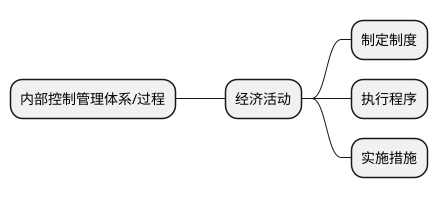

## 目录|审计|内部控制审计|内控管理之内部控制的八大要点

### “一”部《规范》

财政部在2012年根据《中华人民共和国会计法》《中华人民共和国预算法》等法律法规和相关规定，制定《行政事业单位内部控制规范（试行）》（以下简称《规范》），共6章65条，2014年1月1日起施行。  

《规范》为内部控制建设提供了依据，并对内部控制进行定义。内部控制是指单位为实现控制目标，通过制定制度、实施措施和执行程序，对经济活动的风险进行防范和管控。  

### “二”个层面

《规范》将内部控制分为“单位层面内部控制”和“业务层面内部控制”两个层面，并对如何建设内部控制作了具体要求。

| 单位层面要做什么 | 业务层面要做什么 |
| -----------| ----------- |
| 工作组织| 预算管理   |
| 机制建设| 收支管理|
| 制度完善| 政府采购管理|
| 人员管理| 资产管理|
| 财务信息编报| 建设项目管理 |
|| 合同管理|

“单位层面内部控制”和“业务层面内部控制”两个层面紧密联系，但侧重点不同，单位层面侧重于组织、机制、制度的建设，而业务层面侧重于具体实施、操作程序。
业务层面的控制失效可能造成局部的损失，而单位层面的内部控制失效可能导致全局性的内控建设流于形式。

### “三”个抓手

围绕着单位的所有经济活动、业务活动，内部控制将这些活动按流程进行风险分析，并按风险点制定管控措施。将分散的管理制度有机地连接起来，就像生产线一样，制定制度、实施措施和执行程序就是这条生产线上最关键的三大环节。



### “四”大原则

《规范》要求单位建立与实施内部控制，应当遵循下列原则：

| 全面性 | 重要性 |
| ----------| ------ |
| 全方面控制：实现对经济活动的全面控制<br全过程控制：贯穿单位经济活动的决策、执行和监督全过程<br全员控制：涉及单位全体人员| 在全面控制的基础上，应当关注单位**重要经济活动和经济活动的重大风险**   |
| **制衡性** | **适应性** |
| 应当在单位内部的部门管理、职责分工、业务流程等方面形成**相互制约和相互监督** | 应当符合国家有关规定和单位的实际情况，并随着外部环境的变化、单位经济活动的调整和管理要求的提高，不断修订和完善 |

贯彻全面性原则可以保证单位经营活动有序进行。因为，在内部控制程序的所有环节之中，假如有一个环节脱节，没有发挥应有的作用，所有其它起作用的环节，可能都会变得无用。  

重点性原则要求应针对业务处理过程中的关键控制点以及关键岗位加以特别防范。所谓的关键控制点是指业务处理过程中，容易出现漏洞且一旦存在差错会给单位带来巨大损失的高风险领域。内部控制防范不了所有的风险，但是要关注重要业务事项和高风险领域，防范颠覆性风险。  

制衡性原则包括机构设置及分配的制衡和业务流程的制衡。单位应当确保内部机构、岗位和人员的合理设置及其职责权限的合理划分，坚持不相容职务相互分离，确保不同机构和岗位之间相互制约、相互监督。在单位业务流程中，单位可以根据业务流程的过程，设置职能不同的岗位，使它们形成稽核或监督关系，可以防止错误和舞弊的发生，达到业务流程的制衡。  

在适应性的原则下，内部控制的建立和修订应该具有前瞻性，同时必须随着国家法律法规、政策、制度等外部环境的改变，以及单位业务职能的调整、管理要求的提高等内部环境的变化，不断地、及时地进行修订和完善。这样才能促进单位管理水平的不断提高，使内部控制真正发挥其积极作用。  

### “五”大目标

《行政事业单位内部控制规范（试行）》第四条对内部控制的目标进行了详细的描述：  
1.经济活动合法合规  
- 行政事业单位内部控制最基本的目标，是其他目标的基础。  
2.资产安全和使用有效  
- 管理中的重点和难点，是实现单位战略目标的落脚点。  
3.财务信息真实完整  
- 财务管理的基本要求，也是有效的约束机制。  
4.有效防范舞弊和预防腐败  
- 完善三权分立机制，利用内控的制衡原理，发挥流程控制作用，预防腐败。  
5.提高公共服务的效率和效果  
- 提高行政事业单位管理服务效率和效果，促进行政事业单位实现发展战略。  

1.通过内控建设对单位相关规章制度进行梳理和规范，首先从制度建设层面实现合法合规的要求。   

2.资产安全和使用有效，一是资产的安全，不能被挪用、贪污、损坏、随意处置等；二是资产的有效使用，合法合规使用资产，但使用的效果不好，没有达到预期的目标，也是不行的，财政部发布的《项目支出绩效评价管理办法》对资产的使用也提出了要求。  

3.财务信息与会计信息不是同一个概念，会计信息是财务信息的前提，财务信息是在会计信息的基础上，对会计信息进行进一步加工而形成的信息，比如预算报表、决算报表、国有资产报告等。财务信息是对单位经济活动效率和效果客观、综合的反映。  

4.内部控制的核心在于制衡，决策权、执行权、监督权要实现三权分离，通过科学运用内部控制的原理和方法，将制衡机制、不相容岗位分离、信息公开、内部监督等方法和措施嵌入到业务流程和内部管理制度中，在单位建立内部控制体系并有效实施的基础上，起到防范舞弊和预防腐败的作用。  

5.效率效果目标是以前四项目标为基础的，提高公共服务的效率和效果是单位业务活动的总体目标，同时也是单位内部控制的最高目标。建立和实施内部控制，能够改善内部管理水平，提升单位的综合实力，从而最终有利于其职责使命的履行。  

### “六”类业务

内部控制贯穿所有参与经济活动的部门，在业务层面内部控制包括：  
▶健全性  
▶有效性  
▶预算业务控制  
▶收支业务控制  
▶政府采购业务控制  
▶资产控制  
▶建设项目控制  
▶合同控制  
通过业务与财务的有效衔接，满足全面预算绩效管理的要求。逐步建立以预算绩效为导向，以预算管理为主线，以政府会计为抓手，以内部控制为保障的四位一体的现代管理制度。  

```差个图表
差个图表
```

### “七”个步骤

行政事业单位内部控制规范（试行）》第七条，单位应当建立适合本单位实际情况的内部控制体系，并组织实施。具体工作包括：  
1.梳理单位各类经济活动的业务流程  
2.明确业务环节  
3.系统分析经济活动风险  
4.确定风险点  
5.选择风险应对策略  
6.根据国家有关规定建立健全单位各项内部管理制度  

### “八”种方法

1.不相容岗位相互分离  
- 合理设置内部控制关键岗位，形成互相制约、互相监督的工作机制。  
2.内部授权审批控制  
- 明确内部审批程序和相关职责，建立决策和会签制度。  
3.归口管理  
- 明确各业务的归口控制责任单位和控制方式，对经济活动统一管理。  
4.预算控制  
- 加强预算的编审、内部批复、执行、决算和评价四个环节的管理。  
5.财产保护控制  
- 建立资产日常管理制度和定期清查机制，确保资产安全完整。  
6.会计控制  
- 加强会计档案，明确会计凭证、会计账簿和财务会计报告处理程序。  
7.单据控制  
- 外部票据控制和内部表单控制相结合，建立对单据的总体控制体系。  
8.信息内部公开  
- 确定信息内部公开的内容、范围、方式和程序。  

## 关于印发《行政事业单位内部控制规范（试行）》的通知

**<p align="center">财会[2012]21号</P>**

党中央有关部门，国务院各部委、各直属机构，全国人大常委会办公厅，全国政协办公厅，高法院，高检院，各民主党派中央，有关人民团体，各省、自治区、直辖市、计划单列市财政厅（局），新疆生产建设兵团财务局：

为了进一步提高行政事业单位内部管理水平，规范内部控制，加强廉政风险防控机制建设，根据《中华人民共和国会计法》、《中华人民共和国预算法》等法律法规和相关规定，我部制定了《行政事业单位内部控制规范（试行）》，现印发给你们，自2014年1月1日起施行。执行中有何问题，请及时反馈我部。  

附件：行政事业单位内部控制规范（试行）  

**<p align="right">财  政  部</P>**

**<p align="right">2012年11月29日</P>**

## 附件：行政事业单位内部控制规范（试行）

### 第一章 总 则

第一条 为了进一步提高行政事业单位内部管理水平，规范内部控制，加强廉政风险防控机制建设，根据《中华人民共和国会计法》、《中华人民共和国预算法》等法律法规和相关规定，制定本规范。

第二条 本规范适用于各级党的机关、人大机关、行政机关、政协机关、审判机关、检察机关、各民主党派机关、人民团体和事业单位（以下统称单位）经济活动的内部控制。

第三条 本规范所称内部控制，是指单位为实现控制目标，通过制定制度、实施措施和执行程序，对经济活动的风险进行防范和管控。

第四条 单位内部控制的目标主要包括：合理保证单位经济活动合法合规、资产安全和使用有效、财务信息真实完整，有效防范舞弊和预防腐败，提高公共服务的效率和效果。

第五条 单位建立与实施内部控制，应当遵循下列原则：

（一）全面性原则。内部控制应当贯穿单位经济活动的决策、执行和监督全过程，实现对经济活动的全面控制。

（二）重要性原则。在全面控制的基础上，内部控制应当关注单位重要经济活动和经济活动的重大风险。

（三）制衡性原则。内部控制应当在单位内部的部门管理、职责分工、业务流程等方面形成相互制约和相互监督。

（四）适应性原则。内部控制应当符合国家有关规定和单位的实际情况，并随着外部环境的变化、单位经济活动的调整和管理要求的提高，不断修订和完善。

第六条 单位负责人对本单位内部控制的建立健全和有效实施负责。

第七条 单位应当根据本规范建立适合本单位实际情况的内部控制体系，并组织实施。具体工作包括梳理单位各类经济活动的业务流程，明确业务环节，系统分析经济活动风险，确定风险点，选择风险应对策略，在此基础上根据国家有关规定建立健全单位各项内部管理制度并督促相关工作人员认真执行。

### 第二章 风险评估和控制方法

第八条 单位应当建立经济活动风险定期评估机制，对经济活动存在的风险进行全面、系统和客观评估。

经济活动风险评估至少每年进行一次；外部环境、经济活动或管理要求等发生重大变化的，应及时对经济活动风险进行重估。

第九条 单位开展经济活动风险评估应当成立风险评估工作小组，单位领导担任组长。

经济活动风险评估结果应当形成书面报告并及时提交单位领导班子，作为完善内部控制的依据。

第十条 单位进行单位层面的风险评估时，应当重点关注以下方面：

（一）内部控制工作的组织情况。包括是否确定内部控制职能部门或牵头部门；是否建立单位各部门在内部控制中的沟通协调和联动机制。

（二）内部控制机制的建设情况。包括经济活动的决策、执行、监督是否实现有效分离；权责是否对等；是否建立健全议事决策机制、岗位责任制、内部监督等机制。

（三）内部管理制度的完善情况。包括内部管理制度是否健全；执行是否有效。

（四）内部控制关键岗位工作人员的管理情况。包括是否建立工作人员的培训、评价、轮岗等机制；工作人员是否具备相应的资格和能力。

（五）财务信息的编报情况。包括是否按照国家统一的会计制度对经济业务事项进行账务处理；是否按照国家统一的会计制度编制财务会计报告。

（六）其他情况。

第十一条 单位进行经济活动业务层面的风险评估时，应当重点关注以下方面：

（一）预算管理情况。包括在预算编制过程中单位内部各部门间沟通协调是否充分，预算编制与资产配置是否相结合、与具体工作是否相对应；是否按照批复的额度和开支范围执行预算，进度是否合理，是否存在无预算、超预算支出等问题；决算编报是否真实、完整、准确、及时。

（二）收支管理情况。包括收入是否实现归口管理，是否按照规定及时向财会部门提供收入的有关凭据，是否按照规定保管和使用印章和票据等；发生支出事项时是否按照规定审核各类凭据的真实性、合法性，是否存在使用虚假票据套取资金的情形。

（三）政府采购管理情况。包括是否按照预算和计划组织政府采购业务；是否按照规定组织政府采购活动和执行验收程序；是否按照规定保存政府采购业务相关档案。

（四）资产管理情况。包括是否实现资产归口管理并明确使用责任；是否定期对资产进行清查盘点，对账实不符的情况及时进行处理；是否按照规定处置资产。

（五）建设项目管理情况。包括是否按照概算投资；是否严格履行审核审批程序；是否建立有效的招投标控制机制；是否存在截留、挤占、挪用、套取建设项目资金的情形；是否按照规定保存建设项目相关档案并及时办理移交手续。

（六）合同管理情况。包括是否实现合同归口管理；是否明确应签订合同的经济活动范围和条件；是否有效监控合同履行情况，是否建立合同纠纷协调机制。

（七）其他情况。

第十二条 单位内部控制的控制方法一般包括：

（一）不相容岗位相互分离。合理设置内部控制关键岗位，明确划分职责权限，实施相应的分离措施，形成相互制约、相互监督的工作机制。

（二）内部授权审批控制。明确各岗位办理业务和事项的权限范围、审批程序和相关责任，建立重大事项集体决策和会签制度。相关工作人员应当在授权范围内行使职权、办理业务。

（三）归口管理。根据本单位实际情况，按照权责对等的原则，采取成立联合工作小组并确定牵头部门或牵头人员等方式，对有关经济活动实行统一管理。

（四）预算控制。强化对经济活动的预算约束，使预算管理贯穿于单位经济活动的全过程。

（五）财产保护控制。建立资产日常管理制度和定期清查机制，采取资产记录、实物保管、定期盘点、账实核对等措施，确保资产安全完整。

（六）会计控制。建立健全本单位财会管理制度，加强会计机构建设，提高会计人员业务水平，强化会计人员岗位责任制，规范会计基础工作，加强会计档案管理，明确会计凭证、会计账簿和财务会计报告处理程序。

（七）单据控制。要求单位根据国家有关规定和单位的经济活动业务流程，在内部管理制度中明确界定各项经济活动所涉及的表单和票据，要求相关工作人员按照规定填制、审核、归档、保管单据。

（八）信息内部公开。建立健全经济活动相关信息内部公开制度，根据国家有关规定和单位的实际情况，确定信息内部公开的内容、范围、方式和程序。

### 第三章 单位层面内部控制

第十三条 单位应当单独设置内部控制职能部门或者确定内部控制牵头部门，负责组织协调内部控制工作。同时，应当充分发挥财会、内部审计、纪检监察、政府采购、基建、资产管理等部门或岗位在内部控制中的作用。

第十四条 单位经济活动的决策、执行和监督应当相互分离。

单位应当建立健全集体研究、专家论证和技术咨询相结合的议事决策机制。

重大经济事项的内部决策，应当由单位领导班子集体研究决定。重大经济事项的认定标准应当根据有关规定和本单位实际情况确定，一经确定，不得随意变更。

第十五条 单位应当建立健全内部控制关键岗位责任制，明确岗位职责及分工，确保不相容岗位相互分离、相互制约和相互监督。

单位应当实行内部控制关键岗位工作人员的轮岗制度，明确轮岗周期。不具备轮岗条件的单位应当采取专项审计等控制措施。

内部控制关键岗位主要包括预算业务管理、收支业务管理、政府采购业务管理、资产管理、建设项目管理、合同管理以及内部监督等经济活动的关键岗位。

第十六条 内部控制关键岗位工作人员应当具备与其工作岗位相适应的资格和能力。

单位应当加强内部控制关键岗位工作人员业务培训和职业道德教育，不断提升其业务水平和综合素质。

第十七条 单位应当根据《中华人民共和国会计法》的规定建立会计机构，配备具有相应资格和能力的会计人员。

单位应当根据实际发生的经济业务事项按照国家统一的会计制度及时进行账务处理、编制财务会计报告，确保财务信息真实、完整。

第十八条 单位应当充分运用现代科学技术手段加强内部控制。对信息系统建设实施归口管理，将经济活动及其内部控制流程嵌入单位信息系统中，减少或消除人为操纵因素，保护信息安全。

### 第四章 业务层面内部控制

#### 第一节 预算业务控制

第十九条 单位应当建立健全预算编制、审批、执行、决算与评价等预算内部管理制度。

单位应当合理设置岗位，明确相关岗位的职责权限，确保预算编制、审批、执行、评价等不相容岗位相互分离。

第二十条 单位的预算编制应当做到程序规范、方法科学、编制及时、内容完整、项目细化、数据准确。

（一）单位应当正确把握预算编制有关政策，确保预算编制相关人员及时全面掌握相关规定。

（二）单位应当建立内部预算编制、预算执行、资产管理、基建管理、人事管理等部门或岗位的沟通协调机制，按照规定进行项目评审，确保预算编制部门及时取得和有效运用与预算编制相关的信息，根据工作计划细化预算编制，提高预算编制的科学性。

第二十一条 单位应当根据内设部门的职责和分工，对按照法定程序批复的预算在单位内部进行指标分解、审批下达，规范内部预算追加调整程序，发挥预算对经济活动的管控作用。

第二十二条 单位应当根据批复的预算安排各项收支，确保预算严格有效执行。

单位应当建立预算执行分析机制。定期通报各部门预算执行情况，召开预算执行分析会议，研究解决预算执行中存在的问题，提出改进措施，提高预算执行的有效性。

第二十三条 单位应当加强决算管理，确保决算真实、完整、准确、及时，加强决算分析工作，强化决算分析结果运用，建立健全单位预算与决算相互反映、相互促进的机制。

第二十四条 单位应当加强预算绩效管理，建立“预算编制有目标、预算执行有监控、预算完成有评价、评价结果有反馈、反馈结果有应用”的全过程预算绩效管理机制。

#### 第二节 收支业务控制

第二十五条 单位应当建立健全收入内部管理制度。

单位应当合理设置岗位，明确相关岗位的职责权限，确保收款、会计核算等不相容岗位相互分离。

第二十六条 单位的各项收入应当由财会部门归口管理并进行会计核算，严禁设立账外账。

业务部门应当在涉及收入的合同协议签订后及时将合同等有关材料提交财会部门作为账务处理依据，确保各项收入应收尽收，及时入账。财会部门应当定期检查收入金额是否与合同约定相符；对应收未收项目应当查明情况，明确责任主体，落实催收责任。

第二十七条 有政府非税收入收缴职能的单位，应当按照规定项目和标准征收政府非税收入，按照规定开具财政票据，做到收缴分离、票款一致，并及时、足额上缴国库或财政专户，不得以任何形式截留、挪用或者私分。

第二十八条 单位应当建立健全票据管理制度。财政票据、发票等各类票据的申领、启用、核销、销毁均应履行规定手续。单位应当按照规定设置票据专管员，建立票据台账，做好票据的保管和序时登记工作。票据应当按照顺序号使用，不得拆本使用，做好废旧票据管理。负责保管票据的人员要配置单独的保险柜等保管设备，并做到人走柜锁。

单位不得违反规定转让、出借、代开、买卖财政票据、发票等票据，不得擅自扩大票据适用范围。

第二十九条 单位应当建立健全支出内部管理制度，确定单位经济活动的各项支出标准，明确支出报销流程，按照规定办理支出事项。

单位应当合理设置岗位，明确相关岗位的职责权限，确保支出申请和内部审批、付款审批和付款执行、业务经办和会计核算等不相容岗位相互分离。

第三十条 单位应当按照支出业务的类型，明确内部审批、审核、支付、核算和归档等支出各关键岗位的职责权限。实行国库集中支付的，应当严格按照财政国库管理制度有关规定执行。

（一）加强支出审批控制。明确支出的内部审批权限、程序、责任和相关控制措施。审批人应当在授权范围内审批，不得越权审批。

（二）加强支出审核控制。全面审核各类单据。重点审核单据来源是否合法，内容是否真实、完整，使用是否准确，是否符合预算，审批手续是否齐全。

支出凭证应当附反映支出明细内容的原始单据，并由经办人员签字或盖章，超出规定标准的支出事项应由经办人员说明原因并附审批依据，确保与经济业务事项相符。

（三）加强支付控制。明确报销业务流程，按照规定办理资金支付手续。签发的支付凭证应当进行登记。使用公务卡结算的，应当按照公务卡使用和管理有关规定办理业务。

（四）加强支出的核算和归档控制。由财会部门根据支出凭证及时准确登记账簿；与支出业务相关的合同等材料应当提交财会部门作为账务处理的依据。

第三十一条 根据国家规定可以举借债务的单位应当建立健全债务内部管理制度，明确债务管理岗位的职责权限，不得由一人办理债务业务的全过程。大额债务的举借和偿还属于重大经济事项，应当进行充分论证，并由单位领导班子集体研究决定。

单位应当做好债务的会计核算和档案保管工作。加强债务的对账和检查控制，定期与债权人核对债务余额，进行债务清理，防范和控制财务风险。

#### 第三节 政府采购业务控制

第三十二条 单位应当建立健全政府采购预算与计划管理、政府采购活动管理、验收管理等政府采购内部管理制度。

第三十三条 单位应当明确相关岗位的职责权限，确保政府采购需求制定与内部审批、招标文件准备与复核、合同签订与验收、验收与保管等不相容岗位相互分离。

第三十四条 单位应当加强对政府采购业务预算与计划的管理。建立预算编制、政府采购和资产管理等部门或岗位之间的沟通协调机制。根据本单位实际需求和相关标准编制政府采购预算，按照已批复的预算安排政府采购计划。

第三十五条 单位应当加强对政府采购活动的管理。对政府采购活动实施归口管理，在政府采购活动中建立政府采购、资产管理、财会、内部审计、纪检监察等部门或岗位相互协调、相互制约的机制。

单位应当加强对政府采购申请的内部审核，按照规定选择政府采购方式、发布政府采购信息。对政府采购进口产品、变更政府采购方式等事项应当加强内部审核，严格履行审批手续。

第三十六条 单位应当加强对政府采购项目验收的管理。根据规定的验收制度和政府采购文件，由指定部门或专人对所购物品的品种、规格、数量、质量和其他相关内容进行验收，并出具验收证明。

第三十七条 单位应当加强对政府采购业务质疑投诉答复的管理。指定牵头部门负责、相关部门参加，按照国家有关规定做好政府采购业务质疑投诉答复工作。

第三十八条 单位应当加强对政府采购业务的记录控制。妥善保管政府采购预算与计划、各类批复文件、招标文件、投标文件、评标文件、合同文本、验收证明等政府采购业务相关资料。定期对政府采购业务信息进行分类统计，并在内部进行通报。

第三十九条 单位应当加强对涉密政府采购项目安全保密的管理。对于涉密政府采购项目，单位应当与相关供应商或采购中介机构签订保密协议或者在合同中设定保密条款。

#### 第四节 资产控制

第四十条 单位应当对资产实行分类管理，建立健全资产内部管理制度。

单位应当合理设置岗位，明确相关岗位的职责权限，确保资产安全和有效使用。

第四十一条 单位应当建立健全货币资金管理岗位责任制，合理设置岗位，不得由一人办理货币资金业务的全过程，确保不相容岗位相互分离。

（一）出纳不得兼管稽核、会计档案保管和收入、支出、债权、债务账目的登记工作。

（二）严禁一人保管收付款项所需的全部印章。财务专用章应当由专人保管，个人名章应当由本人或其授权人员保管。负责保管印章的人员要配置单独的保管设备，并做到人走柜锁。

（三）按照规定应当由有关负责人签字或盖章的，应当严格履行签字或盖章手续。

第四十二条 单位应当加强对银行账户的管理，严格按照规定的审批权限和程序开立、变更和撤销银行账户。

第四十三条 单位应当加强货币资金的核查控制。指定不办理货币资金业务的会计人员定期和不定期抽查盘点库存现金，核对银行存款余额，抽查银行对账单、银行日记账及银行存款余额调节表，核对是否账实相符、账账相符。对调节不符、可能存在重大问题的未达账项应当及时查明原因，并按照相关规定处理。

第四十四条 单位应当加强对实物资产和无形资产的管理，明确相关部门和岗位的职责权限，强化对配置、使用和处置等关键环节的管控。

（一）对资产实施归口管理。明确资产使用和保管责任人，落实资产使用人在资产管理中的责任。贵重资产、危险资产、有保密等特殊要求的资产，应当指定专人保管、专人使用，并规定严格的接触限制条件和审批程序。

（二）按照国有资产管理相关规定，明确资产的调剂、租借、对外投资、处置的程序、审批权限和责任。

（三）建立资产台账，加强资产的实物管理。单位应当定期清查盘点资产，确保账实相符。财会、资产管理、资产使用等部门或岗位应当定期对账，发现不符的，应当及时查明原因，并按照相关规定处理。

（四）建立资产信息管理系统，做好资产的统计、报告、分析工作，实现对资产的动态管理。

第四十五条 单位应当根据国家有关规定加强对对外投资的管理。

（一）合理设置岗位，明确相关岗位的职责权限，确保对外投资的可行性研究与评估、对外投资决策与执行、对外投资处置的审批与执行等不相容岗位相互分离。

（二）单位对外投资，应当由单位领导班子集体研究决定。

（三）加强对投资项目的追踪管理，及时、全面、准确地记录对外投资的价值变动和投资收益情况。

（四）建立责任追究制度。对在对外投资中出现重大决策失误、未履行集体决策程序和不按规定执行对外投资业务的部门及人员，应当追究相应的责任。

#### 第五节 建设项目控制

第四十六条 单位应当建立健全建设项目内部管理制度。

单位应当合理设置岗位，明确内部相关部门和岗位的职责权限，确保项目建议和可行性研究与项目决策、概预算编制与审核、项目实施与价款支付、竣工决算与竣工审计等不相容岗位相互分离。

第四十七条 单位应当建立与建设项目相关的议事决策机制，严禁任何个人单独决策或者擅自改变集体决策意见。决策过程及各方面意见应当形成书面文件，与相关资料一同妥善归档保管。

第四十八条 单位应当建立与建设项目相关的审核机制。项目建议书、可行性研究报告、概预算、竣工决算报告等应当由单位内部的规划、技术、财会、法律等相关工作人员或者根据国家有关规定委托具有相应资质的中介机构进行审核，出具评审意见。

第四十九条 单位应当依据国家有关规定组织建设项目招标工作，并接受有关部门的监督。

单位应当采取签订保密协议、限制接触等必要措施，确保标底编制、评标等工作在严格保密的情况下进行。

第五十条 单位应当按照审批单位下达的投资计划和预算对建设项目资金实行专款专用，严禁截留、挪用和超批复内容使用资金。

财会部门应当加强与建设项目承建单位的沟通，准确掌握建设进度，加强价款支付审核，按照规定办理价款结算。实行国库集中支付的建设项目，单位应当按照财政国库管理制度相关规定支付资金。

第五十一条 单位应当加强对建设项目档案的管理。做好相关文件、材料的收集、整理、归档和保管工作。

第五十二条 经批准的投资概算是工程投资的最高限额，如有调整，应当按照国家有关规定报经批准。

单位建设项目工程洽商和设计变更应当按照有关规定履行相应的审批程序。

第五十三条 建设项目竣工后，单位应当按照规定的时限及时办理竣工决算，组织竣工决算审计，并根据批复的竣工决算和有关规定办理建设项目档案和资产移交等工作。

建设项目已实际投入使用但超时限未办理竣工决算的，单位应当根据对建设项目的实际投资暂估入账，转作相关资产管理。

#### 第六节 合同控制

第五十四条 单位应当建立健全合同内部管理制度。

单位应当合理设置岗位，明确合同的授权审批和签署权限，妥善保管和使用合同专用章，严禁未经授权擅自以单位名义对外签订合同，严禁违规签订担保、投资和借贷合同。

单位应当对合同实施归口管理，建立财会部门与合同归口管理部门的沟通协调机制，实现合同管理与预算管理、收支管理相结合。

第五十五条 单位应当加强对合同订立的管理，明确合同订立的范围和条件。对于影响重大、涉及较高专业技术或法律关系复杂的合同，应当组织法律、技术、财会等工作人员参与谈判，必要时可聘请外部专家参与相关工作。谈判过程中的重要事项和参与谈判人员的主要意见，应当予以记录并妥善保管。

第五十六条 单位应当对合同履行情况实施有效监控。合同履行过程中，因对方或单位自身原因导致可能无法按时履行的，应当及时采取应对措施。

单位应当建立合同履行监督审查制度。对合同履行中签订补充合同，或变更、解除合同等应当按照国家有关规定进行审查。

第五十七条 财会部门应当根据合同履行情况办理价款结算和进行账务处理。未按照合同条款履约的，财会部门应当在付款之前向单位有关负责人报告。

第五十八条 合同归口管理部门应当加强对合同登记的管理，定期对合同进行统计、分类和归档，详细登记合同的订立、履行和变更情况，实行对合同的全过程管理。与单位经济活动相关的合同应当同时提交财会部门作为账务处理的依据。

单位应当加强合同信息安全保密工作，未经批准，不得以任何形式泄露合同订立与履行过程中涉及的国家秘密、工作秘密或商业秘密。

第五十九条 单位应当加强对合同纠纷的管理。合同发生纠纷的，单位应当在规定时效内与对方协商谈判。合同纠纷协商一致的，双方应当签订书面协议；合同纠纷经协商无法解决的，经办人员应向单位有关负责人报告，并根据合同约定选择仲裁或诉讼方式解决。

### 第五章 评价与监督

第六十条 单位应当建立健全内部监督制度，明确各相关部门或岗位在内部监督中的职责权限，规定内部监督的程序和要求，对内部控制建立与实施情况进行内部监督检查和自我评价。

内部监督应当与内部控制的建立和实施保持相对独立。

第六十一条 内部审计部门或岗位应当定期或不定期检查单位内部管理制度和机制的建立与执行情况，以及内部控制关键岗位及人员的设置情况等，及时发现内部控制存在的问题并提出改进建议。

第六十二条 单位应当根据本单位实际情况确定内部监督检查的方法、范围和频率。

第六十三条 单位负责人应当指定专门部门或专人负责对单位内部控制的有效性进行评价并出具单位内部控制自我评价报告。

第六十四条 国务院财政部门及其派出机构和县级以上地方各级人民政府财政部门应当对单位内部控制的建立和实施情况进行监督检查，有针对性地提出检查意见和建议，并督促单位进行整改。

国务院审计机关及其派出机构和县级以上地方各级人民政府审计机关对单位进行审计时，应当调查了解单位内部控制建立和实施的有效性，揭示相关内部控制的缺陷，有针对性地提出审计处理意见和建议，并督促单位进行整改。

### 第六章 附 则

第六十五条 本规范自2014年1月1日起施行。