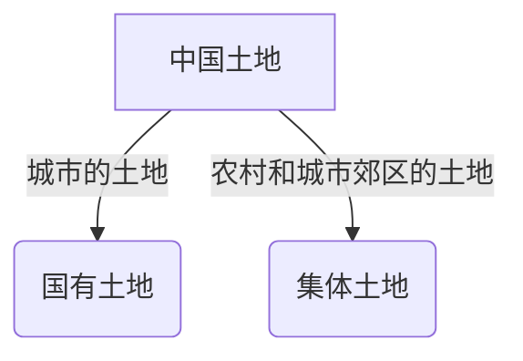

## 土地分多少种类型

### 根据土地所有权分类

土地根据所有权分为国有土地和集体土地。

城市市区的土地属于国家所有。农村和城市郊区的土地，除由法律规定属于国家所有的以外，属于农民集体所有；宅基地和自留地、自留山，属于农民集体所有。

土地所有权是土地所有者在法律规定的范围内，对其拥有的土地享有的占有、使用、收益和处分的权利，是一定社会形态下土地所有制的法律表现。新中国成立后，废除了土地私有制，经过社会主义改造和农业合作化，建立了两种所有制形式并存的社会主义土地公有制，并在法律上确认下来，形成了国家土地所有权和集体土地所有权。

土地使用权是指具备法定条件者，依照法定程序或依约定对国有土地或农民集体土地所享有的占有、利用、收益和有限处分的权利。土地使用权是中国土地使用制度在法律上的体现。国有土地使用权是指国有土地的使用人依法利用土地并取得收益的权利，而农民集体土地使用权是指农民集体土地的使用人依法利用土地并取得收益的权利。农民集体土地使用权可分为农用土地使用权、宅基地使用权和建设用地使用权。

### 根据土地用途分类

根据土地用途分为：农用地、建设用地和未利用地。

农用地是指直接用于农业生产的土地，包括耕地、林地、草地、农田水利用地、养殖水面等；

建设用地是指建造建筑物、构筑物的土地，包括城乡住宅和公共设施用地、工矿用地、交通水利设施用地、旅游用地、军事设施用地等；

未利用地是指农用地和建设用地以外的土地。

### 根据土地利用现状分类

《土地利用现状分类》国家标准采用一级、二级两个层次的分类体系，共分12个一级类、57个二级类。其中一级类包括：耕地、园地、林地、草地、商服用地、工矿仓储用地、住宅用地、公共管理与公共服务用地、特殊用地、交通运输用地、水域及水利设施用地、其他土地。《中华人民共和国土地管理法》与《土地利用现状分类》中类别的对照关系：

## 建设用地分几类？

**各是什么含义？ **

建设用地按用地性质一般分五类：商业用地、综合用地、住宅用地、工业用地和其他用地。

### 商服用地

商服用地是指该宗地块规划的用地性质是用于建设商业服务业用房屋，出让后用地的使用年限为40年。可细分为批发零售用地、住宿餐饮用地、商务金融用地、其他商服用地。

### 综合用地

综合用地是指不同用途的土地所构成的土地，即同一宗地包含两种或两种以上不同用途的土地，例如商业、居住综合用9地，科研设计、办公综合用地等。

### 住宅用地

传统意义上的住宅用地，有两层意义：

一是住宅建筑基底占地及其四周合理间距内的用地（含宅间绿地和宅间小路等）的总称。

二是供人们日常生活居住的房基地（有独立院落的包括院落）。包括：城镇单一住宅用地，即城镇居民的普通住宅、公寓、别墅用地；城镇混合住宅用地，即城镇居民以居住为主的住宅与工业或商业等混合用地；农村宅基地，即农村村民居住的宅基地；空闲宅基地，即村庄内部的空闲旧宅基地及其他空闲土地等。

### 工业用地

工业用地就是指独立设置的工厂、车间、手工业作坊、建筑安装的生产场地、排渣（灰）场地等用地。工业用地进一步细分为一类、二类、三类工业用地。

一类工业用地：对居住和公共设施等环境基本无干扰和污染的工业用地如电子工业、缝纫工业、工艺品制造工业等用地

二类工业用地：对居住和公共设施等环境有一定干扰和污染的工业用地如食品工业、医药制造工业、纺织工业等用地

三类工业用地：对居住和公共设施等环境有严重干扰和污染的工业用地如采掘工业、冶金工业、大中型机械制造工业、化学工业、造纸工业、制革工业、建材工业等用地

### 其他用地

其他用地是指规划范围内除居住区用地以外的各种用地，包括非直接为本区居民配建的道路用地、其他单位用地、保留的自然村或不可建设用地等。

## 各类建设用地使用权有多少年？

- （1）居住用地70年；
- （2）工业用地50年；
- （3）教育、科技、文化、卫生、体育用地50年；
- （4）商业、旅游、娱乐用地40年；
- （5）综合或者其他用地50年。

## 建设用地使用权取得方式有哪些？

土地使用权取得有划拨与出让两种方式。

### 划拨

根据《划拨土地使用权管理暂行办法》第二条规定：划拨土地使用权，是指土地使用者通过除出让土地使用权以外的其他各种方式依法取得的国有土地使用权。

《中华人民共和国城市房地产管理法》第二十三条对划拨土地使用权的取得途径进行了规定：土地使用权划拨，是指县级以上人民政府依法批准，在土地使用者缴纳补偿、安置等费用后将该幅土地交付其使用，或者将土地使用权无偿交付给土地使用者使用的行为。依照本法规定以划拨方式取得土地使用权的，除法律、行政法规另有规定外，没有使用期限的限制。

划拨的土地不得进行转让、出租和抵押。

由于承担公共项目的职责，国有企业与政府平台公司的无形资产科目经常出现划拨土地。

### 出让

出让方式有四种：招标、拍卖、挂牌和协议方式。出让的土地使用权人具有法定规范内的处置权，可进行转让、出租和抵押。

#### 1.招标

招标出让国有土地使用权，是指市、县人民政府土地行政主管部门发布招标公告，邀请特定或者不特定的公民、法人和其他组织参加国有土地使用权投标，根据投标结果确定土地使用者的行为。

#### 2.拍卖

拍卖出让国有土地使用权，是指市、县人民政府土地行政主管部门发布拍卖公告，由竞买人在指定时间、地点进行公开竞价，根据出价结果确定土地使用者的行为。

#### 3.挂牌

挂牌出让国有土地使用权，是指市、县人民政府土地行政主管部门发布挂牌公告，按公告规定的期限将拟出让宗地的交易条件在指定的土地交易场所挂牌公布，接受竞买人的报价申请并更新挂牌价格，根据挂牌期限截止时的出价结果确定土地使用者的行为。

#### 4.协议出让

协议出让国有土地使用权，是指国家以协议方式将国有土地使用权在一定年限内出让给土地使用者，由土地使用者向国家支付土地使用权出让金的行为。

出让国有土地使用权，除依照法律、法规和规章的规定应当采用招标、拍卖或者挂牌方式外，方可采取协议方式。

## 哪些土地使用权可以通过划拨获得？

对国家重点扶持的能源、交通、水利等基础设施用地项目，可以以划拨方式提供土地使用权。对以营利为目的，非国家重点扶持的能源、交通、水利等基础设施用地项目，应当以有偿方式提供土地使用权。

根据中华人民共和国国土资源部令第9号《划拨用地目录》，下列土地可以划拨获得:

- （一）党政机关和人民团体用地
  - 1.办公用地。 
  - 2.安全、保密、通讯等特殊专用设施。 
- （二）军事用地
- （三）城市基础设施用地
  - 1．供水设施    
  - 2．燃气供应设施   
  - 3．供热设施
  - 4．公共交通设施
  - 5．环境卫生设施    
  - 6．道路广场 
  - 7．绿地 
- （四）非营利性邮政设施用地 
- （五）非营利性教育设施用地 
- （六）公益性科研机构用地 
- （七）非营利性体育设施用地     
- （八）非营利性公共文化设施用地    
  - 1.图书馆    
  - 2.博物馆       
  - 3.文化馆   
  - 4.青少年宫、青少年科技馆、青少年（儿童）活动中心 
- （九）非营利性医疗卫生设施用地     
  - 1．医院、门诊部（所）、急救中心（站）、城乡卫生院。     
  - 2.各级政府所属的卫生防疫站（疾病控制中心）、健康教育所、专科疾病防治所(站)。     
  - 3.各级政府所属的妇幼保健所(院、站)、母婴保健机构、儿童保健机构、血站（血液中心、中心血站）。  
- （十）非营利性社会福利设施用地
  - 1.福利性住宅。        
  - 2.综合性社会福利设施。        
  - 3.老年人社会福利设施。         
  - 4.儿童社会福利设施。          
  - 5.残疾人社会福利设施。        
  - 6.收容遣送设施。    
  - 7.殡葬设施。 
- （十一）石油天然气设施用地 
- （十二）煤炭设施用地   
- （十三）电力设施用地 
- （十四）水利设施用地 
- （十五）铁路交通设施用地 
- （十六）公路交通设施用地 
- （十七）水路交通设施用地 
- （十八）民用机场设施用地 
- （十九）特殊用地
  - 1.监狱。    
  - 2.劳教所。    
  - 3.戒毒所、看守所、治安拘留所、收容教育所。
  
## 哪些土地使用权可以通过协议出让获得？

根据《中华人民共和国土地管理法》、《中华人民共和国城市房地产管理法》、2003年国土资源部令第21号《协议出让国有土地使用权规定》等规定，以下土地使用权可通过协议出让方式获得：

（一）商业、旅游、娱乐和商品住宅等各类经营性用地和工业用地以外用途的土地，其供地公告公布后同一宗地只有一个意向用地者的；

（二）原划拨、承租土地使用权人申请办理协议出让，经依法批准，可以采取协议方式，但《国有建设用地使用权划拨决定书》、《国有建设用地使用权租赁合同》、法律、法规、行政规定等明确应当收回土地使用权重新公开出让的除外；

（三）划拨土地使用权转让申请办理协议出让，经依法批准，可以采取协议方式，但《国有建设用地使用权划拨决定书》、法律、法规、行政规定等明确应当收回土地使用权重新公开出让的除外；

（四）已出让、租赁土地申请改变用地规划条件的，经规划行政主管部门批准，可以采用协议方式，但《国有土地使用权出让合同》、《国有土地使用权租赁合同》另有约定的除外；

（五）出让的国有建设用地使用权人申请续期，可以采用协议方式；

（六）在划拨供应的建设项目中，需要整体规划建设的配套项目，建设用地不能分割供应的，可以采用协议方式供应；

（七）对无法单独确定规划条件实施供应的城市边角地、夹心地、插花地等，可以按规划部门批准的相邻建设用地规划条件，协议出让给该建设项目主体；

（八）利用地铁站（场）、公共服务设施、交通枢纽等公共空间进行上盖物业或多功能立体开发利用的，其建设用地使用权以协议方式出让给已经取得交通建设项目建设用地的使用权人；以协议方式取得的地铁站（场）、公共服务设施、交通枢纽等配套开发建设用地使用权，以自主开发为主，物业自持；

（九）对营利性养老服务机构利用存量建设用地从事养老设施建设，涉及划拨建设用地使用权出让（租赁）或转让的，在原土地用途符合规划的前提下，可不改变土地用途，允许补缴土地出让金（租金），办理协议出让或租赁手续；

（十）经营性文化事业单位转制为一般竞争性企业的，原生产经营性划拨用地可采用协议出让或租赁方式进行土地资产处置；

（十一）由于城市规划调整、经济形势发生变化、企业转型等原因，土地使用权人已依法取得的国有划拨工业用地补办出让、国有承租工业用地补办出让，符合规划并经依法批准，可以采取协议方式；

（十二）对因搬迁改造被收回原国有土地使用权的企业，经批准可采取协议出让方式，按土地使用标准为其安排同类用途用地；

（十三）企业改制（破产、兼并、合并等）时，未纳入企业改制资产的生产经营性建设用地使用权可以协议方式出让给改制文件确定的承接主体；

（十四）采矿、采石、采砂、盐田等地面生产和尾矿堆放用地，鼓励采取租赁，也可协议方式出让；

（十五）本实施意见发布前已形成的历史违法用地，包括集体建设用地上已建成项目的，经行政部门处罚后，需完善国有建设用地供应手续的，可以采取协议方式出让；

（十六）人民法院生效法律文书和协助执行通知书要求办理国有建设用地手续，涉及出让的，可以采取协议方式出让给协助执行通知书明确的土地使用者；

（十七）法律、法规、行政规定明确可以协议出让的其他情形

一共分为17类土地，土地使用权转让申请办理协议出让，必须要经过相关部门的审批或者人民法院的执行通知书才可以进行，必须要符合相关的法律法规的规定。

## 哪些土地使用权必须通过招拍挂获得？

（一）供应商业、旅游、娱乐和商品住宅等各类经营性用地以及有竞争要求的工业用地；

（二）其他土地供地计划公布后同一宗地有两个或者两个以上意向用地者的；

（三）划拨土地使用权改变用途，《国有土地划拨决定书》或法律、法规、行政规定等明确应当收回土地使用权，实行招标拍卖挂牌出让的；

（四）划拨土地使用权转让，《国有土地划拨决定书》或法律、法规、行政规定等明确应当收回土地使用权，实行招标拍卖挂牌出让的；

（五）出让土地使用权改变用途，《国有土地使用权出让合同》约定或法律、法规、行政规定等明确应当收回土地使用权，实行招标拍卖挂牌出让的；

（六）法律、法规、行政规定明确应当招标拍卖挂牌出让的其他情形。

## 什么是宗地？

土地使用权人的权属界址范围内的地块，权属界址线所封闭的地块。一般情况下，一宗地为一个权属单位；同一个土地使用者使用不相连接的若干地块时，则每一地块分别为一宗。

以宗地为基本单位统一编号，叫宗地号，又称地号，其有四层含义，称为:区、带、片、宗，从大范围逐级体现其所在的地理位置。如:B107-24这个地号表示福田区第1带07片第24宗地。

## 什么是红线图？

红线图是规划局确定的项目建筑总平面图，或城市规范管理部门正式确定的项目建筑的总用地面积的示意图，其中红线是用来表示建筑物的边界外沿界限，即实际可使用土地的边界图。

建筑红线一般为建筑物的占地界限，用实红线表示，二层以上有阳台用虚红线表示，表示底层不占用地。也称“建筑控制线”，指城市规划管理中，控制城市道路两侧沿街建筑物或构筑物(如外墙、台阶等)靠临街面的界线。任何临街建筑物或构筑物不得超过建筑红线。

## 什么是边角地、夹心地、插花地？

### 边角地

边角地是指在城市规划区或者村庄建设规划区内难以单独出具规划条件、被"三旧"改造范围地块与建设规划边沿或者线性工程控制用地范围边沿分隔（割）、面积小于3亩的地块。

### 夹心地

夹心地是指在城市规划区或者村庄建设规划区内难以单独出具规划条件、被"三旧"改造范围地块包围或者夹杂于其中、面积小于3亩的地块。

### 插花地

插花地是指在城市规划区或者村庄建设规划区内难以单独出具规划条件、与"三旧"改造范围地块形成交互楔入状态、面积小于3亩的地块。

## 什么是边角地、夹心地、插花地？

### 边角地

边角地是指在城市规划区或者村庄建设规划区内难以单独出具规划条件、被"三旧"改造范围地块与建设规划边沿或者线性工程控制用地范围边沿分隔（割）、面积小于3亩的地块。

### 夹心地

夹心地是指在城市规划区或者村庄建设规划区内难以单独出具规划条件、被"三旧"改造范围地块包围或者夹杂于其中、面积小于3亩的地块。

### 插花地

插花地是指在城市规划区或者村庄建设规划区内难以单独出具规划条件、与"三旧"改造范围地块形成交互楔入状态、面积小于3亩的地块。

## 建设用地使用权转让有何要求？

《国务院办公厅关于完善建设用地使用权转让、出租、抵押二级市场的指导意见》国办发〔2019〕34号：

以划拨方式取得的建设用地使用权转让，需经依法批准，土地用途符合《划拨用地目录》的，可不补缴土地出让价款，按转移登记办理；不符合《划拨用地目录》的，在符合规划的前提下，由受让方依法依规补缴土地出让价款。

以作价出资或入股方式取得的建设用地使用权转让，参照以出让方式取得的建设用地使用权转让有关规定，不再报经原批准建设用地使用权作价出资或入股的机关批准；转让后，可保留为作价出资或入股方式，或直接变更为出让方式。

以出让方式取得的建设用地使用权转让，在符合法律法规规定和出让合同约定的前提下，应充分保障交易自由；原出让合同对转让条件另有约定的，从其约定。

根据《中华人民共和国城市房地产管理法》第三十九条　以出让方式取得土地使用权的，转让房地产时，应当符合下列条件：（一）按照出让合同约定已经支付全部土地使用权出让金，并取得土地使用权证书；（二）按照出让合同约定进行投资开发，属于房屋建设工程的，完成开发投资总额的百分之二十五以上，属于成片开发土地的，形成工业用地或者其他建设用地条件。

## 什么是土地增减挂钩？

《城乡建设用地增减挂钩节余指标跨省域调剂管理办法》：

城乡建设用地增减挂钩节余指标跨省域调剂，是指“三区三州”及其他深度贫困县城乡建设用地增减挂钩节余指标（以下简称节余指标）由国家统筹跨省域调剂使用。其中“三区三州”（即西藏、四省藏区、南疆四地州和四川凉山州、云南怒江州、甘肃临夏州）。

“土地增减挂钩”，增是指城镇建设用地指标的增加，减是指农村建设用地指标的减少（主要是深度贫困地区），增减要挂钩，从以宅基地为主的村庄占地中腾出土地复垦，将这种“耕地的增加”作为指标卖给建设用地紧缺的城里，城里购买了多少指标，就可以增加利用多少耕地，将这指标一增一减进行跨区域挂钩。

## 什么是耕地占补平衡？

耕地占补平衡政策是指建设占用多少耕地，各地人民政府就应补充划入多少数量和质量相当的耕地。占用耕地的单位要负责开垦与所占用耕地的数量和质量相当的耕地；没有条件开垦的，应依法缴纳耕地开垦费，专款用于开垦新的耕地。

## 什么是储备土地？

### 土地储备

土地储备是指县级（含）以上国土资源主管部门为调控土地市场、促进土地资源合理利用，依法取得土地，组织前期开发、储存以备供应的行为。

### 土地储备机构

《土地储备管理办法》:土地储备机构应为县级（含）以上人民政府批准成立、具有独立的法人资格、隶属于所在行政区划的国土资源主管部门、承担本行政辖区内土地储备工作的事业单位。国土资源主管部门对土地储备机构实施名录制管理。市、县级国土资源主管部门应将符合规定的机构信息逐级上报至省级国土资源主管部门，经省级国土资源主管部门审核后报国土资源部，列入全国土地储备机构名录，并定期更新。

### 储备土地拟

收储土地，是指已纳入土地储备计划或经县级（含）以上人民政府批准，目前已启动收回、收购、征收等工作，但未取得完整产权的土地；

入库储备土地，是指土地储备机构已取得完整产权，纳入储备土地库管理的土地。---以上均摘自国土资规〔2017〕17号《土地储备管理办法》

## 什么是生地、毛地、净地、熟地？

一般而言，生地、净地重点着眼于出让；而毛地、熟地更多着眼于建设。

### 生地

生地是指在城市旧区范围内，已列入拆迁计划而尚未经过拆迁安置补偿的土地。

### 毛地

毛地是指国土局尚未出让、拍卖、划拨土地使用权的土地。毛地上存在需要被拆除的建筑物、构筑物等其他设施、且未进行前期基础设施建设、尚不具备二级开发建设的条件。

### 净地

净地是指已经完成拆除，地面平整，并且不存在未被拆除的建筑物、构筑物等其他设施的土地。

从权属的角度看，净地是指没有设定他项权利，土地占有、使用、收益、处分等权利不受限制的土地。

### 熟地

熟地主要是指经过征地、拆迁和市政基础设施投入，可直接用于建设的土地。

## 什么是土地整理？

土地整理亦称“土地整治、土地调整或土地重划”，是实施土地利用规划的重要手段，指将零碎高低不平和不规整的土地或被破坏的土地加以整理，使人类在土地利用中不断建设土地和重新配置土地的过程。

简单说就是：将土地重新规划利用、调整用途，使土地利用效率、效益更高，更符合当地规划的各项目标所需。其主要类型及分类如下：

## 什么是全域土地综合整治？

《自然资源部关于开展全域土地综合整治试点工作的通知》：

“全域土地综合整治是以科学规划为前提，以乡镇为基本实施单元，整体开展农用地、建设用地整理和乡村生态保护修复等，对闲置、利用低效、生态退化及环境破坏的区域实施国土空间综合治理的活动。”

## 什么是土地一级开发？

从生地到熟地的过程就是土地一级开发。

土地一级开发，是由政府或其授权委托的企业，对一定区域范围内的城市国有土地（毛地）、乡村集体土地（生地）进行统一的征地、拆迁、安置、补偿，使之成为净地，并进行适当的市政配套设施建设，使该区域范围内的土地达到“三通一平”（通水、通电、通路和土地平整），"五通一平"（通水、通电、通路、通讯、通气、土地平整），或“七通一平”（通给水、通排水、通电、通讯、通路、通燃气、通热力、土地平整）的建设条件（熟地），再对熟地进行有偿出让或转让的过程。

## 土地一级开发流程有哪些？

（一）土地一级阶段包括“前期手续阶段”、“组织实施阶段”和“土地入市阶段”。

一般而言，规范的一级开发主要子工作阶段包括取得授权、完成立项核准、融资、签订征地补偿协议、取得征地批复、取得拆迁许可证、完成拆迁、市政工程施工许可证获取、市政工程移交、供地验收、成本与地价审核、土地入市交易和一级市场投入回收。在实际操作中，这些节点在时间上存在交叉性。

