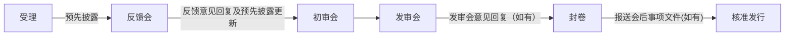
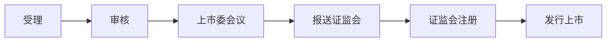
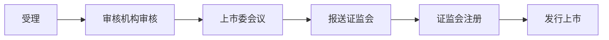

关于主板、科创板、创业板、北交所IPO审核工作流程，或许有些人还不是很了解。尚普君今天将IPO详细审核流程分享给各位有需要的人士。

## 主板

证监会IPO审核工作流程分为受理、反馈会、初审会、发审会、封卷、核准发行等主要环节，分别由不同处室负责，相互配合、相互制约。对每一个发行人的审核决定均通过会议以集体讨论的方式提出意见，避免个人决断。

### 一、基本审核流程图

### 二、首发申请审核主要环节简介

#### （一）受理和预先披露

中国证监会受理部门根据《中国证券监督管理委员会行政许可实施程序规定》（证监会令第138号，以下简称《行政许可程序规定》）、《首次公开发行股票并上市管理办法》（证监会令第141号）、《首次公开发行股票并在创业板上市管理办法》（证监会令第142号）等规则的要求，依法受理首发申请文件，并按程序转发行监管部。发行监管部在正式受理后即按程序安排预先披露，并将申请文件分发至相关监管处室，相关监管处室根据发行人的行业、公务回避的有关要求以及审核人员的工作量等确定审核人员。

#### （二）反馈会

相关监管处室审核人员审阅发行人申请文件后，从非财务和财务两个角度撰写审核报告，提交反馈会讨论。反馈会主要讨论初步审核中关注的主要问题，确定需要发行人补充披露以及中介机构进一步核查说明的问题。

反馈会按照申请文件受理顺序安排。反馈会由综合处组织，参会人员有相关监管处室审核人员和处室负责人等。反馈会后将形成书面意见，履行内部程序后反馈给保荐机构。反馈意见发出前不安排发行人及其中介机构与审核人员沟通。

保荐机构收到反馈意见后，组织发行人及相关中介机构按照要求进行回复。综合处收到反馈意见回复材料进行登记后转相关监管处室。审核人员按要求对申请文件以及回复材料进行审核。

发行人及其中介机构收到反馈意见后，在准备回复材料过程中如有疑问可与审核人员进行沟通，如有必要也可与处室负责人、部门负责人进行沟通。

审核过程中如发生或发现应予披露的事项，发行人及其中介机构应及时报告发行监管部并补充、修改相关材料。初审工作结束后，将形成初审报告（初稿）提交初审会讨论。

#### （三）预先披露更新

发行人对反馈意见已按要求回复、财务资料未过有效期、且需征求意见的相关政府部门无异议的，将安排预先披露更新。对于具备条件的项目，发行监管部将通知保荐机构报送发审会材料和用于更新的预先披露材料，并在收到相关材料后安排预先披露更新，以及按受理顺序安排初审会。

#### （四）初审会

初审会由审核人员汇报发行人的基本情况、初步审核中发现的主要问题及反馈意见回复情况。初审会由综合处组织，发行监管部相关负责人、相关监管处室负责人、审核人员以及发审委委员（按小组）参加。

根据初审会讨论情况，审核人员修改、完善初审报告。初审报告是发行监管部初审工作的总结，履行内部程序后与申请材料一并提交发审会。

初审会讨论决定提交发审会审核的，发行监管部在初审会结束后出具初审报告，并书面告知保荐机构需要进一步说明的事项以及做好上发审会的准备工作。初审会讨论后认为发行人尚有需要进一步披露和说明的重大问题、暂不提交发审会审核的，将再次发出书面反馈意见。

#### （五）发审会

发审委制度是发行审核中的专家决策机制。目前发审委委员不固定分组，采用电脑摇号的方式，随机产生项目审核小组，依次参加初审会和发审会。各组中委员个人存在需回避事项的，按程序安排其他委员替补。发审委通过召开发审会进行审核工作。发审会以投票方式对首发申请进行表决。根据《中国证券监督管理委员会发行审核委员会办法》规定，发审委会议审核首发申请适用普通程序。发审委委员投票表决采用记名投票方式，会前需撰写工作底稿，会议全程录音。

发审会召开5天前中国证监会发布会议公告，公布发审会审核的发行人名单、会议时间、参会发审委委员名单等。首发发审会由审核人员向委员报告审核情况，并就有关问题提供说明，委员发表审核意见，发行人代表和保荐代表人各2名到会陈述和接受询问，聆询时间不超过40分钟，聆询结束后由委员投票表决。发审会认为发行人有需要进一步披露和说明问题的，形成书面审核意见后告知保荐机构。

保荐机构收到发审委审核意见后，组织发行人及相关中介机构按照要求回复。综合处收到审核意见回复材料后转相关监管处室。审核人员按要求对回复材料进行审核并履行内部程序。

#### （六）封卷

发行人的首发申请通过发审会审核后，需要进行封卷工作，即将申请文件原件重新归类后存档备查。封卷工作在按要求回复发审委意见后进行。如没有发审委意见需要回复，则在通过发审会审核后即进行封卷。

#### （七）会后事项

会后事项是指发行人首发申请通过发审会审核后，招股说明书刊登前发生的可能影响本次发行上市及对投资者作出投资决策有重大影响的应予披露的事项。发生会后事项的需履行会后事项程序，发行人及其中介机构应按规定向综合处提交会后事项材料。综合处接收相关材料后转相关监管处室。审核人员按要求及时提出处理意见。需重新提交发审会审核的，按照会后事项相关规定履行内部工作程序。如申请文件没有封卷，则会后事项与封卷可同时进行。

#### （八）核准发行

核准发行前，发行人及保荐机构应及时报送发行承销方案。

封卷并履行内部程序后，将进行核准批文的下发工作。发行人领取核准发行批文后，无重大会后事项或已履行完会后事项程序的，可按相关规定启动招股说明书刊登工作。

审核程序结束后，发行监管部根据审核情况起草持续监管意见书，书面告知日常监管部门。

### 三、与发行审核流程相关的其他事项

发行审核过程中，我会还根据特殊行业企业的具体情况，征求相关主管部门是否同意其发行股票的意见。

为深入贯彻落实国家西部大开发战略、支持西部地区经济社会发展，改进发行审核工作服务水平，充分发挥沪、深两家交易所的服务功能，更好地支持实体经济发展，首发审核工作整体按西部企业优先，均衡安排沪、深交易所拟上市企业审核进度的原则实施。同时，依据上述原则，并结合企业申报材料的完备情况，对具备条件进入后续审核环节的企业按受理顺序顺次安排审核进度计划。

发行审核过程中的终止审查、中止审查和恢复审查按相关规定执行。审核过程中收到举报材料的，依程序处理。

发行审核过程中，将按照对首发企业信息披露质量抽查的相关要求组织抽查。

发行审核过程中遇到现行规则没有明确规定的新情况、新问题，发行监管部将召开专题会议进行研究，并根据内部工作程序提出处理意见和建议。

## 科创板

### 一、基本审核流程图

### 二、IPO审核流程

#### （一）受理

上交所科创板股票发行上市审核工作实行全程电子化，申请、受理、问询、回复等事项均通过本所发行上市审核系统办理。发行人应当通过保荐人以电子文档形式向本所提交发行上市申请文件，本所收到发行上市申请文件后5个工作日内作出是否予以受理的决定。本所受理的，发行人于受理当日在本网站等指定渠道预先披露招股说明书及相关文件。

交易所受理发行上市申请文件后的10个工作日内，保荐人将上传工作底稿及验证版招股说明书，供监管备查。

#### （二）审核

本所审核机构自受理之日起20个工作日内发出审核问询，发行人及保荐人应及时、逐项回复本所问询。审核问询可多轮进行。

首轮问询发出前，发行人及其保荐人、证券服务机构及其相关人员不得与审核人员接触，不得以任何形式干扰审核工作。首轮问询发出后，发行人及其保荐人如确需当面沟通的，可通过发行上市审核系统预约。

审核机构认为不需要进一步问询的，将出具审核报告提交上市委员会。

本所审核和中国证监会注册的时间总计不超过三个月，发行人及其保荐人、证券服务机构回复本所审核问询，以及中止审核、请示有权机关、落实上市委员会意见、暂缓审议、处理会后事项、实施现场检查、要求进行专项核查，并要求发行人补充、修改申请文件等情形的时间不计算在内。

#### （三）上市委会议

上市委召开会议对本所审核机构出具的审核报告及发行人上市申请文件进行审议，与会委员就审核机构提出的初步审核意见，提出审议意见。上市委员会可以要求对发行人代表及其保荐人进行现场问询。上市委员会做出同意或者不同意发行上市的审议意见。

发行人存在发行条件、上市条件或者信息披露方面的重大事项有待进一步核实，无法形成审议意见的，经会议合议，上市委员会可以对该发行人的发行上市申请暂缓审议。暂缓审议时间不超过2个月。

#### （四）报送证监会

本所结合上市委审议意见，出具发行人是否符合发行条件、上市条件和信息披露要求的审核意见。本所审核通过的，将审核意见、相关审核资料和发行人的发行上市申请文件报送中国证监会履行注册程序。中国证监会认为存在需要进一步说明或者落实事项的，可以要求本所进一步问询。

本所审核不通过的，作出终止发行上市审核的决定。

#### （五）证监会注册

中国证监会在20个工作日内对发行人的注册申请作出同意或者不予注册的决定。

#### （六）发行上市

中国证监会同意注册的决定自作出之日起1年内有效，发行人应当按照规定在注册决定有效期内发行股票，发行时点由发行人自主选择。

## 创业板

### 一、基本审核流程图

### 二、IPO审核流程

#### （一）受理

深交所收到发行人注册申请文件后，于5个工作日内作出是否受理的决定。申请文件不符合深交所要求的，应当在30个工作日内补正。

交易所受理发行上市申请文件后的10个工作日内，保荐人将上传工作底稿及验证版招股说明书，供监管备查。

#### （二）审核

深交所审核机构自受理之日起20个工作日内发出审核问询，发行人及保荐人应及时、逐项回复本所问询。需要再次问询的，在收到回复后10个工作日内发出。

深交所审核机构在3个月内作出审核决定（其中审核问询的时间不计算在内，发行人及其保荐人、证券服务机构回复交易所审核问询的时间总计不超过三个月）。

#### （三）上市委会议

上市委召开会议对深交所审核机构出具的审核报告及发行人上市申请文件进行审议，与会委员就审核机构提出的初步审核意见，提出审议意见。上市委员会可以要求对发行人代表及其保荐人进行现场问询。上市委员会通过合议形成发行人是否符合发行条件、上市条件和信息披露要求的审议意见。

发行人存在发行条件、上市条件或者信息披露方面的重大事项有待进一步核实，无法形成审议意见的，经会议合议，上市委员会可以对该发行人的发行上市申请暂缓审议。暂缓审议时间不超过2个月。

#### （四）报送证监会

本所结合上市委审议意见，出具发行人是否符合发行条件、上市条件和信息披露要求的审核意见。本所审核通过的，将审核意见、相关审核资料和发行人的发行上市申请文件报送中国证监会履行注册程序。中国证监会认为存在需要进一步说明或者落实事项的，可以要求深交所进一步问询。

深交所审核不通过的，作出终止发行上市审核的决定。

#### （五）证监会注册

中国证监会在20个工作日内对发行人的注册申请作出同意或者不予注册的决定。

#### （六）发行上市

中国证监会同意注册的决定自作出之日起1年内有效，发行人应当按照规定在注册决定有效期内发行股票，发行时点由发行人自主选择。

## 北交所

### 一、基本审核流程图

### 二、IPO审核流程

#### （一）受理

北交所实行电子化审核，申请、受理、问询、回复等事项均通过本所审核系统办理。发行人通过保荐机构以电子文档形式向本所提交申请文件。本所在收到申请文件后5个工作日内作出是否受理的决定。受理当日，招股说明书等预先披露文件在本所网站披露。

北交所受理后仅做形式审查，材料齐备的出具受理通知书，材料不齐备的，一次性告知补正。补正时限最长不超过30个工作日。保荐机构报送的发行上市申请文件在12个月内累计2次被不予受理的，自第2次收到本所不予受理通知之日起3个月后，方可报送新的发行上市申请文件。

#### （二）审核机构审核

自受理之日起20个工作日内，北交所审核机构通过审核系统发出首轮问询。发行人及其保荐机构、证券服务机构应当及时、逐项回复审核问询事项。审核问询可多轮进行。

首轮问询发出前，发行人、保荐机构、证券服务机构及其相关人员不得与审核人员接触，不得以任何形式干扰审核工作（静默期）。首轮问询发出后，发行人及其保荐机构、证券服务机构可与本所审核机构进行沟通；确需当面沟通的，应当预约。

此时，部分不符合北交所上市要求的公司会被“劝退”；部分公司会选择主动“撤材料”；部分公司可能会选择“带病上会”被否决的可能就会比较大。

发行人/中介机构需要在20个工作日内回复问询 ，至多延长不超过20个工作日。

北交所审核机构认为不需要进一步问询的，出具审核报告并提请上市委员会审议。

#### （三）上市委员会审议

上市委员会召开审议会议，对申请文件和审核机构的审核报告进行审议，通过合议形成发行人是否符合发行条件、上市条件和信息披露要求的审议意见。上市委员会进行审议时要求对发行人及其保荐机构进行现场问询的，发行人代表及保荐代表人应当到会接受问询，回答参会委员提出的问题。

北交所结合上市委员会审议意见，出具发行人符合发行条件、上市条件和信息披露要求的审核意见或作出终止发行上市审核的决定。

北交所自受理发行上市申请文件之日起2个月内形成审核意见，但发行人及其保荐机构、证券服务机构回复审核问询的时间，以及中止审核、请示有权机关、落实上市委员会意见、暂缓审议、处理会后事项、实施现场检查、实施现场督导、要求进行专项核查，并要求发行人补充、修改申请文件等情形，不计算在前述时限内。

#### （四）报送证监会

北交所审核通过的，向中国证监会报送发行人符合发行条件、上市条件和信息披露要求的审核意见、相关审核资料和发行人的发行上市申请文件。

中国证监会认为存在需要进一步说明或者落实事项的，可以要求本所进一步问询。

#### （五）证监会注册

中国证监会在20个工作日内作出同意注册或不予注册的决定，通过要求北交所进一步问询、要求保荐机构和证券服务机构等对有关事项进行核查、对发行人现场检查等方式要求发行人补充、修改申请文件的时间不计算在内。

发行人发生重大事项，导致不符合发行条件的不予注册/撤销注册。中国证监会作出不予注册决定的，自决定作出之日起6个月后，发行人可以再次提出公开发行股票并上市申请。

#### （六）发行上市

中国证监会同意注册的，发行人依照规定发行股票。中国证监会的予以注册决定，自作出之日起一年内有效，发行人应当在注册决定有效期内发行股票，发行时点由发行人自主选择。